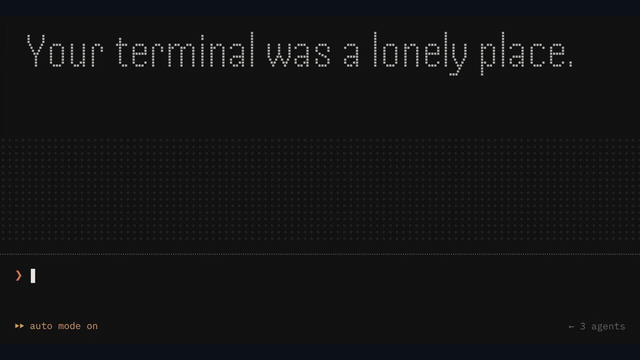
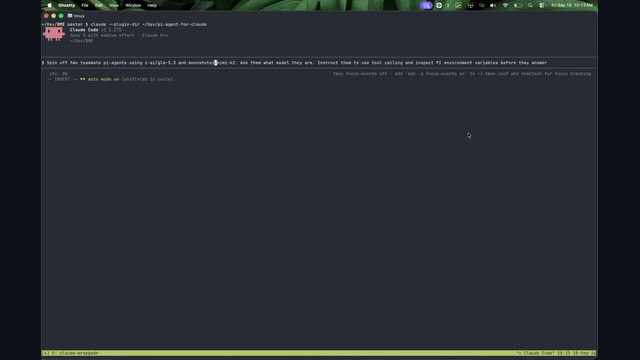
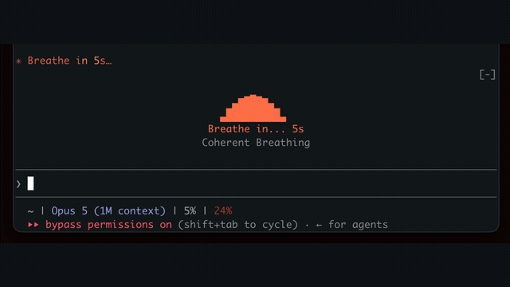
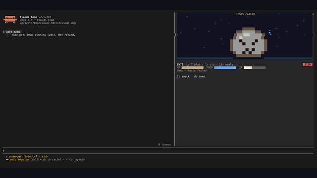
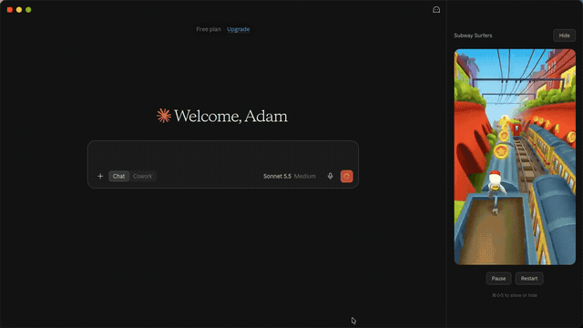
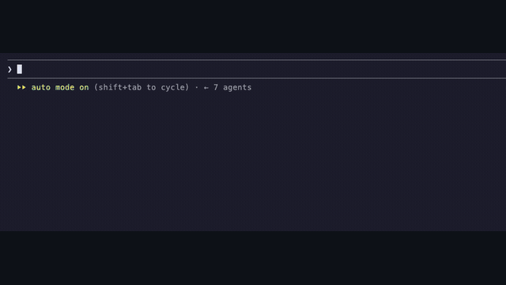
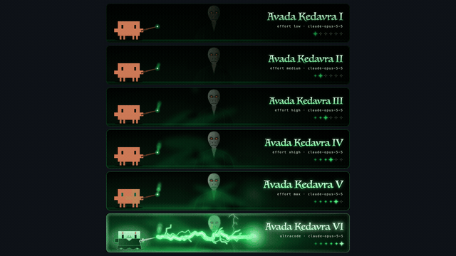
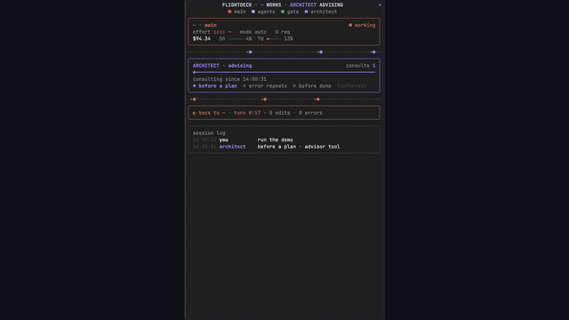

<h1 align="center">Awesome Claude Code Mods</h1>

<p align="center"><a href="https://findmods.dev"></a></p>

<p align="center"><strong>Browse the latest mods. Discover your next upgrade.</strong></p>
<p align="center">A community collection of <strong>Claude Code mods, plugins and extensions</strong>. Find terminal dashboards, agent tools, workflow improvements and games, with visual demos and links to the original repositories.</p>
<p align="center"><a href="#showcase">See the showcase</a> · <a href="#browse-by-category">Browse categories</a> · <a href="#faq">FAQ</a> · <a href="#contribute">Contribute a mod</a> · <a href="https://findmods.dev">FindMods.dev ↗</a></p>
<p align="center"><sub>Independent community collection. Not affiliated with, sponsored by, or endorsed by Anthropic or Claude.</sub></p>

<a id="showcase"></a>

## Mod showcase

<table>
<tr><td width="33%" align="center" valign="top"><p><a href="https://github.com/therahul-yo/clawdman"></a></p><p><strong><a href="https://github.com/therahul-yo/clawdman">Clawdman</a></strong></p></td><td width="33%" align="center" valign="top"><p><a href="https://github.com/FazalAAli/pi-agent-for-claude"></a></p><p><strong><a href="https://github.com/FazalAAli/pi-agent-for-claude">pi agent for Claude</a></strong></p></td><td width="33%" align="center" valign="top"><p><a href="https://github.com/halluton/Mindful-Claude"></a></p><p><strong><a href="https://github.com/halluton/Mindful-Claude">Mindful Claude</a></strong></p></td></tr>
<tr><td width="33%" align="center" valign="top"><p><a href="https://github.com/OneWave-AI/claude-code-mods"></a></p><p><strong><a href="https://github.com/OneWave-AI/claude-code-mods">Claude Code Mods</a></strong></p></td><td width="33%" align="center" valign="top"><p><a href="https://github.com/henrik-thevibe/Claude-Fables"></a></p><p><strong><a href="https://github.com/henrik-thevibe/Claude-Fables">Claude Fables</a></strong></p></td><td width="33%" align="center" valign="top"><p><a href="https://github.com/adamholter/claude-subway-surfers"></a></p><p><strong><a href="https://github.com/adamholter/claude-subway-surfers">Claude Subway Surfers</a></strong></p></td></tr>
<tr><td width="33%" align="center" valign="top"><p><a href="https://github.com/giovaborgogno/cc-dino"></a></p><p><strong><a href="https://github.com/giovaborgogno/cc-dino">cc-dino</a></strong></p></td><td width="33%" align="center" valign="top"><p><a href="https://github.com/powerofjinbo/claude-code-spell-bar"></a></p><p><strong><a href="https://github.com/powerofjinbo/claude-code-spell-bar">Claude Code Spell Bar</a></strong></p></td><td width="33%" align="center" valign="top"><p><a href="https://github.com/scasella/claude-flightdeck"></a></p><p><strong><a href="https://github.com/scasella/claude-flightdeck">Claude Flightdeck</a></strong></p></td></tr>
</table>

<a id="browse-by-category"></a>

<h2>Browse by category </h2>

[Usage & costs](#usage) · [Agents & orchestration](#agents) · [Planning & tasks](#planning) · [Files & navigation](#files) · [Git & code review](#git) · [Safety & permissions](#safety) · [Memory & context](#memory) · [Interface & themes](#interface) · [Prompts & input](#prompts) · [Testing & debugging](#testing) · [Browser & web](#web) · [Notifications & focus](#focus) · [Games & entertainment](#games) · [Integrations & utilities](#integrations)

<a id="usage"></a>

### Usage & costs

Track token usage, context limits, session costs and model effort.

- **[5dive-ai/5dive-plugins](https://github.com/5dive-ai/5dive-plugins)** - 5dive telemetry producer, seat panel, command surface and tool-call policy guard for Claude Code function hooks (early access).
- **[arasovic/claude-code-mods](https://github.com/arasovic/claude-code-mods)** - Mods including compact-keeper, loop-guard, search-meter, turn-footer.
- **[Arunjay4213/claude-mods](https://github.com/Arunjay4213/claude-mods)** - Mods including budget-guard, context-lens, quota-meter, token-ledger.
- **[augiefra/claude-mods](https://github.com/augiefra/claude-mods)** - One line above the prompt: context weather, tokens, a bar per recent prompt, then your 5-hour and 7-day limits against the time elapsed, with the…
- **[aycandv/claude-usage-meter](https://github.com/aycandv/claude-usage-meter)** - A usage board for Claude Code: a weekly pace gauge and a sliding ticker of your spend per model, in the terminal and on the desktop
- **[azkhh/drift](https://github.com/azkhh/drift)** - Are you moving or hiding in the dark?
- **[ban-dal/claude-mods](https://github.com/ban-dal/claude-mods)** - Mods including codex-board, usage-meter.
- **[bendrucker/claude](https://github.com/bendrucker/claude)** - Mods including classifier-telemetry, herdr, run-command.
- **[betobetico/powerup](https://github.com/betobetico/powerup)** - /powerups: las lecciones de Claude Code en un panel con botones, en el terminal y en la app de escritorio.
- **[ccdwyer/budget-governor](https://github.com/ccdwyer/budget-governor)** - Enforces session and daily spend caps: a live gauge above the prompt, a wrap-up nudge at 80%, and new prompts refused at the cap
- **[ccdwyer/netrunner-hud](https://github.com/ccdwyer/netrunner-hud)** - A cyberpunk dashboard pane for your session: braille context gauge, live token oscilloscope, tool-call waterfall and git/test/job/cost widgets,…
- **[chrisns/spare10-mod](https://github.com/chrisns/spare10-mod)** - Keeps the last part of your 5-hour and weekly quota for you.
- **[ChristianBuzzetti/ClaudeMods](https://github.com/ChristianBuzzetti/ClaudeMods)** - Mods including boberto, usage-meters.
- **[cskwork/claude-code-mods](https://github.com/cskwork/claude-code-mods)** - Mods including blast-radius, token-weather.
- **[DaKev/usage-wrapup](https://github.com/DaKev/usage-wrapup)** - When your plan usage gets low, tells every running agent to wrap up before the limit cuts it off
- **[DanielPodolsky/tokencraft](https://github.com/DanielPodolsky/tokencraft)** - A Minecraft-inspired world for Claude Code: tool calls become blocks and XP, the sky follows your context, the weather follows your plan limits
- **[davidurco/cc-tamagotchi](https://github.com/davidurco/cc-tamagotchi)** - A Tamagotchi that lives in Claude Code: it hatches, eats the work Claude does, leaves bugs behind, gets sick, throws tantrums and grows into one of…
- **[DominickGiordano/claude-mods](https://github.com/DominickGiordano/claude-mods)** - Mods including auth-guard, fleet, handoff, meter and more.
- **[drewpayment/jev-route](https://github.com/drewpayment/jev-route)** - Routes each turn to the cheapest capable Claude model using Jev, TypeSafe's decision model.
- **[elijah-rou/agent-kit](https://github.com/elijah-rou/agent-kit)** - Clipboard commands, read-only Git changes, and turn-level token throughput
- **[Flam1ngFir3ball/jev-claude-router](https://github.com/Flam1ngFir3ball/jev-claude-router)** - Routes each Claude Code turn to the model and effort TypeSafe's Jev picks, weighed against what a switch costs, and compacts with Jev instead of a…
- **[fstandhartinger/limitpace](https://github.com/fstandhartinger/limitpace)** - Live subscription usage and pace bars, with an optional provider-neutral delegation advisor
- **[Gooner44/ClaudeMods](https://github.com/Gooner44/ClaudeMods)** - Band above the prompt showing Session, Weekly and Fable 5.1 usage
- **[hamza-siddiq/claude-eta](https://github.com/hamza-siddiq/claude-eta)** - Time left on the working turn, on the spinner line: from the task list's pace, else from how long your turns run.
- **[hamza-siddiq/token-showers](https://github.com/hamza-siddiq/token-showers)** - A live forecast of the context window, in the band above the prompt. /token-weather turns it on or off
- **[HolyGrail/claude-mods](https://github.com/HolyGrail/claude-mods)** - Mods including notice-board, pr-relay, usage-meter, zsh-safe.
- **[iamkhalid2/usage-band](https://github.com/iamkhalid2/usage-band)** - Mod: a slim retro line above the prompt showing your plan's 5-hour and weekly usage limits
- **[ilkayGkbdk/cctop](https://github.com/ilkayGkbdk/cctop)** - htop for Claude Code: context, rate limits, speed, cost and subagents, live
- **[imsalik/claude-mods](https://github.com/imsalik/claude-mods)** - Context window forecast plus 5h/7d rate-limit usage with reset countdowns, drawn above the prompt
- **[japan-da-man/claude-code](https://github.com/japan-da-man/claude-code)** - Mods including blast-radius, replay-theater, spec-flow, todo-mod and more.
- **[jessetsai1024/claude-mods](https://github.com/jessetsai1024/claude-mods)** - Mods including ctx-panel, maomao, prompts, timeline.
- **[jetsongdev/jet-router](https://github.com/jetsongdev/jet-router)** - Experimental Claude Code effort router: fake and opt-in Jev shadow
- **[jumoog/claude_mod_usage](https://github.com/jumoog/claude_mod_usage)** - Always shows your 5-hour and weekly plan usage above the prompt, with when each window resets
- **[kawase1295/usage-meter](https://github.com/kawase1295/usage-meter)** - Model, context window and rate-limit (5h / 7d) braille meters in a band above the prompt
- **[KhadeerBasha1232/claude-usage-mod](https://github.com/KhadeerBasha1232/claude-usage-mod)** - Your Claude plan usage in one line above the prompt: 5-hour and weekly limits with reset times, context window, model and session cost
- **[kreddevils18/claude-clawd](https://github.com/kreddevils18/claude-clawd)** - Clawd, a pixel pet that reacts to what Claude Code does: grows with context, tires with rate limits, levels up with hats
- **[kreddevils18/claude-usage-mod](https://github.com/kreddevils18/claude-usage-mod)** - Your Claude Code usage as colored chips above the prompt: 5h and weekly limits (% left), session cost and spend history. /usage-mod opens the full…
- **[lenadweb/claude-code-plugins](https://github.com/lenadweb/claude-code-plugins)** - Mods including lenadweb-image-preview, lenadweb-usage-meter.
- **[Liberty-Technical-Solutions/claude-workflow-mods](https://github.com/Liberty-Technical-Solutions/claude-workflow-mods)** - Mods including all-mods, mod-installer, next-steps, ship-it and more.
- **[lucenity0/claude-code-mods](https://github.com/lucenity0/claude-code-mods)** - Mods including ding, seatbelt, session-dash, turn-meter.
- **[Luma-Sa/claude-mods](https://github.com/Luma-Sa/claude-mods)** - Bandeau au-dessus du prompt : limites 5h/7j, coût et tokens de sortie
- **[lunatictaco/claude-mods](https://github.com/lunatictaco/claude-mods)** - Mods including figure-ledger, project-tree, protein-pet, run-board.
- **[MiguelMachado-dev/miguel-mods](https://github.com/MiguelMachado-dev/miguel-mods)** - Mods including prompt-enhancer, turn-telemetry.
- **[mohammed-alsalhi/usage-band](https://github.com/mohammed-alsalhi/usage-band)** - A band above the prompt graphing each rate-limit window (5 hours, week, per-model week) since its last reset
- **[moritalous/claude-mods-router](https://github.com/moritalous/claude-mods-router)** - Mods including effort-router, model-router.
- **[mrzzmrzz/claude-code-mods](https://github.com/mrzzmrzz/claude-code-mods)** - Context window weather, tok/s, prompt-cache hit rate and TTL, and cache auto-warm, in the band above the prompt
- **[nalyk/nalyk-skills](https://github.com/nalyk/nalyk-skills)** - Hook-enforced development discipline for Claude Code.
- **[nathanliow/meme-watch](https://github.com/nathanliow/meme-watch)** - Live USD PnL for the top 5 memecoin positions in a Solana wallet, plus a live chart terminal for any token.
- **[NotTahaAli/sessclone](https://github.com/NotTahaAli/sessclone)** - Sends Claude Code usage to a SessClone deployment
- **[nvr0x5/claude-deck](https://github.com/nvr0x5/claude-deck)** - A cockpit for Claude Code: plan bars and subagent strips, context, usage limits with reset countdowns and burn rates, spend, the model route and a…
- **[Para-FR/claude-code-mods-fr](https://github.com/Para-FR/claude-code-mods-fr)** - Mods including cockpit, garde-du-corps.
- **[pawandeepdhall/claude-mods](https://github.com/pawandeepdhall/claude-mods)** - Mods including next-steps, usage-band.
- **[quango2304/leo_claude_mod](https://github.com/quango2304/leo_claude_mod)** - Leo's Claude Code mods: usage bars, limits, cost, prompt cache countdown, active time and running agents
- **[richkuo/claude-code-model-effort-shortcuts](https://github.com/richkuo/claude-code-model-effort-shortcuts)** - Keyboard shortcuts that step the reasoning effort level and the model up and down; the footer shows what each request uses
- **[s-hiraoku/claude-mods](https://github.com/s-hiraoku/claude-mods)** - Shows context, 5-hour and 7-day limit usage as SVG meters above the prompt in the Desktop app
- **[sahiltalwar88/claude-mods](https://github.com/sahiltalwar88/claude-mods)** - Mods including session-ledger, still-going.
- **[salatmaster/claude-gamba](https://github.com/salatmaster/claude-gamba)** - A slot machine you spin while your agent works.
- **[Schweem/usage-report](https://github.com/Schweem/usage-report)** - Shows context fill, 5-hour and weekly quota, and session cost on the status line under the prompt, with warnings near your limits
- **[sgmonda/statusbar](https://github.com/sgmonda/statusbar)** - A session status bar for Claude Code Desktop: your 5-hour and weekly usage limits with time to reset, session and turn clocks, and running…
- **[Sh0ckWaveZero/claude-mods](https://github.com/Sh0ckWaveZero/claude-mods)** - Pill band above the Claude Code prompt: 5h and 7d rate-limit gauges, session tokens and cost.
- **[ShahriarBijoy/claude-mods](https://github.com/ShahriarBijoy/claude-mods)** - Mods including stack, wartezeit.
- **[shichang4fun/claude-mods](https://github.com/shichang4fun/claude-mods)** - Mods including next-steps-desktop, usage-limit.
- **[Sma1lboy/claude-mods](https://github.com/Sma1lboy/claude-mods)** - A status line under the prompt: context, cache hit rate, cache TTL countdown, today's spend for this project, and why a turn missed the cache.…
- **[Steven-ODell/claude-usage-line](https://github.com/Steven-ODell/claude-usage-line)** - Claude usage (5-hour, 7-day, context) in the prompt footer, with how far ahead of or behind an even pace you are
- **[szarkans/gamble-with-claude-code](https://github.com/szarkans/gamble-with-claude-code)** - Slots, European roulette and blackjack in your terminal.
- **[tanuu5/usage-log](https://github.com/tanuu5/usage-log)** - ターンが終わるたびに使用率などを記録し、7日枠の目安（ペース表）との差を入力欄の下に出す
- **[TLOBillyQ/claude-mods](https://github.com/TLOBillyQ/claude-mods)** - Mods including blast-radius, replay-theater, token-weather.
- **[Toshkee/clawd-usage](https://github.com/Toshkee/clawd-usage)** - Clawd waves his ultracode wand and does his banner tricks above the prompt beside live meters of context, rate limits and cost
- **[travisoa/claude-mods](https://github.com/travisoa/claude-mods)** - A live forecast of the context window and the 5-hour and weekly quota, drawn above the prompt
- **[unclecode/jevshift](https://github.com/unclecode/jevshift)** - Experimental Jev-assisted model and effort selection for Claude Code: observe, pin, off, and opt-in auto
- **[Vosssa/claude-usage-band](https://github.com/Vosssa/claude-usage-band)** - 5h / weekly usage, context fill and prompt-cache warmth above the prompt
- **[WoBok/claude-mods](https://github.com/WoBok/claude-mods)** - Shows context and rate-limit usage in the prompt footer
- **[zaferayan/claude-cost-meter](https://github.com/zaferayan/claude-cost-meter)** - What this session has cost so far, live above the prompt

<a id="agents"></a>

### Agents & orchestration

Coordinate subagents, compare models and follow agent activity.

- **[ahbanavi/claude-mods](https://github.com/ahbanavi/claude-mods)** - Shows each running subagent's model and effort on the hint line above the agent list
- **[Ahmad8864/cc-side](https://github.com/Ahmad8864/cc-side)** - A separate agent conversation in Claude Code's right-hand pane, forked from the current context
- **[alex2481kobe/claude-mods](https://github.com/alex2481kobe/claude-mods)** - Mods including agent-models, peek.
- **[alexandernicholson/agent-router](https://github.com/alexandernicholson/agent-router)** - Choose subagent models with /agent-models and click the prompt panel to inspect activity, token usage, and routing.
- **[augbastos/afkswitch](https://github.com/augbastos/afkswitch)** - AFKSwitch by augbastos , Tell your agents when you're away and when you're back
- **[barmoshe/bar-mods](https://github.com/barmoshe/bar-mods)** - Mods including mission-control, modsmith, turn-meter.
- **[bps2414/clawd-mods](https://github.com/bps2414/clawd-mods)** - Mods including cloud-pet, handoff, native-guard, session-board.
- **[Bulls-Work/bullswarm](https://github.com/Bulls-Work/bullswarm)** - Bullswarm as a Claude Mod: live subscription meters for every installed coding-agent CLI above the prompt, quota-aware routing of Claude's own…
- **[ccdwyer/departure-board](https://github.com/ccdwyer/departure-board)** - A Solari split-flap departure board for the agent's real work: tasks flip letter by letter in amber as they board, depart, get delayed or cancelled
- **[ccdwyer/loop-breaker](https://github.com/ccdwyer/loop-breaker)** - Stops the agent repeating the same failing command or undoing its own edits, and shows a stuck meter above the prompt
- **[Charlie0113-T/claude-agent-flow](https://github.com/Charlie0113-T/claude-agent-flow)** - The agent flow pane: /flow opens a live tree of the session's subagents and teammates beside the transcript, fed by engine events, with a text…
- **[corrupt952/dotfiles](https://github.com/corrupt952/dotfiles)** - Mods including classify-hint, verify-reports.
- **[darkautism/ext-agent](https://github.com/darkautism/ext-agent)** - Run Claude Code subagents in pi or opencode instead of a Claude model.
- **[dipthong7119/TTCS_K8S4_N5](https://github.com/dipthong7119/TTCS_K8S4_N5)** - AGENTS.md as project instructions, by one option.
- **[estruyf/claude-agent-watch-mod](https://github.com/estruyf/claude-agent-watch-mod)** - Keeps the number of running Claude Code sessions under a limit and shows the ones waiting on you or sitting idle
- **[FazalAAli/pi-agent-for-claude](https://github.com/FazalAAli/pi-agent-for-claude)** - Run pi-powered models as native Claude Code subagents.
- **[float-ritual-stack/pi-herdr-outliner](https://github.com/float-ritual-stack/pi-herdr-outliner)** - Pi Outliner integration for Claude Code, following the outline the session folder is bound to: typed outline, workboard and door tools for agents…
- **[franciscocarloserra/claude-code-multiharness-delegation](https://github.com/franciscocarloserra/claude-code-multiharness-delegation)** - Route Agent calls with subagent_type multiharness-delegation:&lt;harness&gt; to an interactive external harness in tmux
- **[GastonGelhorn/jevmate](https://github.com/GastonGelhorn/jevmate)** - A fast decision layer for coding agents.
- **[getexcited/stepwarden](https://github.com/getexcited/stepwarden)** - Every tool call your agent makes, checked before it runs.
- **[HaoYan-A/claude-code-mods](https://github.com/HaoYan-A/claude-code-mods)** - Run each subagent on any model (gpt-6, grok-4.7, ...) at any reasoning effort, through model and effort parameters on the Agent tool
- **[henrik-thevibe/Claude-Fables](https://github.com/henrik-thevibe/Claude-Fables)** - Coding activity becomes a cartoon in a choice of visual styles.
- **[HoshimuraYuto/cc-sidecar](https://github.com/HoshimuraYuto/cc-sidecar)** - See what codex, claude and gemini do when Claude Code delegates to them from Bash
- **[itsArnavPrasad/pixel-office](https://github.com/itsArnavPrasad/pixel-office)** - Every Claude Code session as a pixel character in a shared office you can click and talk to
- **[jimador/brigade](https://github.com/jimador/brigade)** - Coordinate a fleet of cheap parallel coding agents from any ticket source (Notion, ClickUp, Obsidian vault boards, or a local folder of markdown…
- **[Kiy-K/oxide](https://github.com/Kiy-K/oxide)** - Picks the model and the reasoning effort for each task with TypeSafe's Jev, a System One decision model reached either through TypeSafe's own API or…
- **[kys0213/kys-claude-plugin](https://github.com/kys0213/kys-claude-plugin)** - 통합 개발 워크플로우 , spec/git/orchestrator/workflow 를 관심사 단위 skill 로 큐레이션한 단일 plugin
- **[masahide/agent-kit](https://github.com/masahide/agent-kit)** - Mods including agentctl, doc-desk.
- **[Miracle0x0/CCometixLine](https://github.com/Miracle0x0/CCometixLine)** - Experimental in-process subagent activity for CCometixLine
- **[neolitec/code-buddy](https://github.com/neolitec/code-buddy)** - Comment on your dev app in the browser; one background agent per comment makes the change and answers in the thread
- **[nogu66/claude-code](https://github.com/nogu66/claude-code)** - Mods including agent-aquarium, git-ops.
- **[railyai/claude-code-mods](https://github.com/railyai/claude-code-mods)** - Raily is a personal AI agent that finds people worth meeting for you (friends, dates, business contacts) and handles the first contact.
- **[RedesignedRobot/cdx](https://github.com/RedesignedRobot/cdx)** - Run OpenAI Codex and Google Antigravity execution lanes from Claude Code with background event delivery, status tracking, and raw command protection
- **[rlorenzo/ai-coding-setup](https://github.com/rlorenzo/ai-coding-setup)** - Mods including explore-model, review-gate.
- **[roshbhatia/sysinit](https://github.com/roshbhatia/sysinit)** - Mods including sysinit-diff, sysinit-output.
- **[rse/ase](https://github.com/rse/ase)** - Agentic Software Engineering (ASE)
- **[ruvnet/ruflo](https://github.com/ruvnet/ruflo)** - Mods including ruflo-ruos, ruflo-swarm.
- **[sayre4ux/autopilot](https://github.com/sayre4ux/autopilot)** - Multi-agent orchestrator harness for Claude Code: command loop, ledger, dispatch protocol, review cycle, model-economics, and a registry-driven…
- **[scasella/claude-flightdeck](https://github.com/scasella/claude-flightdeck)** - A live dashboard for context, costs, permissions and agents.
- **[Tolsee/dotfiles](https://github.com/Tolsee/dotfiles)** - Corrects the model tier of every subagent spawn (agent.spawn) with a live Jev judgment (haiku / sonnet / opus), instead of relying on /delegate's…
- **[ushironoko/dotfiles](https://github.com/ushironoko/dotfiles)** - Mods including agents-view, file-view, pr-view.
- **[wickedhardflip/claude-code-mods](https://github.com/wickedhardflip/claude-code-mods)** - Mods including first-mod, run-breakdown, session-recap, subagent-models.
- **[yai333/autonomous-loop](https://github.com/yai333/autonomous-loop)** - A state-machine graph engine that drives a ticket through claim -&gt; worktree -&gt; coding -&gt; evaluate -&gt; review -&gt; human approval, spawning and…
- **[yodem/agentic-label-engineering](https://github.com/yodem/agentic-label-engineering)** - /ale-board: a live task board for an Agentic Label Engineering (ALE) run above the prompt and in a docked pane.

<a id="planning"></a>

### Planning & tasks

Organize tasks, follow plans and keep work moving through checkpoints.

- **[0x5421/plan-progress](https://github.com/0x5421/plan-progress)** - Live plan progress bars above the Claude Code prompt: stages, steps, a pixel fill and soft sounds for decision, error and done
- **[bengous/claude-code-plugins](https://github.com/bengous/claude-code-plugins)** - Mods including todos, vellum.
- **[Dan-Millie-Front/turn-progress](https://github.com/Dan-Millie-Front/turn-progress)** - Live status bar above the prompt for each turn: request, thinking, working, answer
- **[djnsty23/claude-auto-dev](https://github.com/djnsty23/claude-auto-dev)** - Autonomous development workflow: brainstorm, auto, iterate, audit, review, ship, plus the prd.json sprint system
- **[fernandomoraes/loose-ends](https://github.com/fernandomoraes/loose-ends)** - A live checklist above the prompt of the conversation's loose ends: questions left unanswered, points made in passing, caveats and deferred work it…
- **[genail/genail-mods](https://github.com/genail/genail-mods)** - Live progress bars above the prompt for background shells and subagents
- **[hoangbits/claude-implement-plan-tracker](https://github.com/hoangbits/claude-implement-plan-tracker)** - Live pane with every step of the current plan, the current step marked, and a done/total count
- **[home-dev-lab/workflow-toolbox](https://github.com/home-dev-lab/workflow-toolbox)** - Mods including workflow-toolbox, wt-deep-search, wt-rules-on-demand, wt-secret-guard.
- **[hoobnn/hoobnn-agent-mods](https://github.com/hoobnn/hoobnn-agent-mods)** - Mods including hitokoto, hud, receipt, todo-bar and more.
- **[JAICHANGPARK/ASD-STE100](https://github.com/JAICHANGPARK/ASD-STE100)** - ASD-STE100 (Simplified Technical English) and 80% Karpathy Mode plugin, mod, and skill for Claude Code.
- **[konnokai/claude-mods](https://github.com/konnokai/claude-mods)** - Mods including plan-tally, ship-weather.
- **[mofocm/scope-creep-receipt](https://github.com/mofocm/scope-creep-receipt)** - After every turn, Claude Code prints you a receipt for everything it did while you asked for one thing
- **[nateherkai/claude-code-mods](https://github.com/nateherkai/claude-code-mods)** - Mods including cache-keeper, collision-guard, goal-meter, recording-mode.
- **[philm123/claude-code-receipts](https://github.com/philm123/claude-code-receipts)** - Receipts for consultants: a scope creep siren for change orders, and undo receipts that turn rm into a move to trash with a Restore button
- **[poindexter12/loadout](https://github.com/poindexter12/loadout)** - The Loadout's core work board and orchestration loop for Claude Code.
- **[roaringsoul404/cc-mods](https://github.com/roaringsoul404/cc-mods)** - Mods including turn-receipt, wasted.
- **[romtaugranot/issue-map](https://github.com/romtaugranot/issue-map)** - Draws a Project's open Issues as a Map joined by the Links its Tracker records, inside Claude Code
- **[SaharCarmel/linear-mod](https://github.com/SaharCarmel/linear-mod)** - /linear: your Linear projects, milestones and issues in a pane beside the transcript.
- **[spiiritual/claude-code-stuff](https://github.com/spiiritual/claude-code-stuff)** - Mods including better-compaction, whiteboard-defense.
- **[swei99386-alt/exam-gate](https://github.com/swei99386-alt/exam-gate)** - Before Claude calls a task done, run your checklist.
- **[thieung/claude-mods](https://github.com/thieung/claude-mods)** - Mods including ak-cockpit, ghost-proc-guard, worktree-guard.
- **[threesil/claude-mods](https://github.com/threesil/claude-mods)** - Mods including claw-guard, claw-heartbeat, claw-hud, claw-memory and more.
- **[tractorjuice/arckit-claude](https://github.com/tractorjuice/arckit-claude)** - The Enterprise Architecture Governance Harness - 76 slash commands across strategy, architecture, delivery, and assurance
- **[tungnt1203/cmusic](https://github.com/tungnt1203/cmusic)** - Shows cmusic's track, a progress bar and the lyric being sung under the prompt; /lyrics opens a karaoke pane
- **[unpaged/plugins](https://github.com/unpaged/plugins)** - Renders Claude Code plans as whiteboards on Unpaged. /unpaged:visual-plan turns the plan in your conversation into a canvas of phases, tasks, and…
- **[wasd96040501/taskcut](https://github.com/wasd96040501/taskcut)** - Compacts when the work moves on from one sub-task to the next instead of when the context window fills, including in the middle of a long turn.
- **[zyx1121/music-mod](https://github.com/zyx1121/music-mod)** - /music: what macOS Music.app is playing, in one line above the prompt.

<a id="files"></a>

### Files & navigation

Browse files, inspect project structure and navigate your workspace.

- **[aqaurius6666/claude-blast-radius](https://github.com/aqaurius6666/claude-blast-radius)** - When a Bash command asks for permission, preview its blast radius: rm targets measured (files, size, what git can't restore), plus your own regex -&gt;…
- **[bn-l/claude-autoresearch-mod](https://github.com/bn-l/claude-autoresearch-mod)** - Autonomous experiment loop for Claude Code: run, measure, keep or discard.
- **[ccdwyer/codebase-galaxy](https://github.com/ccdwyer/codebase-galaxy)** - Your repo as a live force-directed starfield in braille: files are stars, imports are faint links, and Claude's attention is a comet that flies to…
- **[ccdwyer/review-ghost](https://github.com/ccdwyer/review-ghost)** - Attaches a file's unresolved GitHub PR review threads to the model's Read and Edit results, so review comments get fixed in the file it is already…
- **[choas/claude-mods](https://github.com/choas/claude-mods)** - Mods including cwd-status, git-status.
- **[choidevhi/choitree](https://github.com/choidevhi/choitree)** - Live pane for Claude Code: file tree, git status, where Claude is working, tokens and usage limits, scoped to the current project
- **[cprussin/claude-code-mods](https://github.com/cprussin/claude-code-mods)** - Sample mod: denies edits to .env files
- **[davekiss/env](https://github.com/davekiss/env)** - Edit .env files in a pane inside Claude Code.
- **[falkoro/claude-scenes](https://github.com/falkoro/claude-scenes)** - Replaces the spinner with a tiny animated text-art scene of what Claude is doing right now: reading, searching, editing, running tests, waiting on you
- **[gblacher2/repo-sessions](https://github.com/gblacher2/repo-sessions)** - Pane listing the Claude Code and Codex sessions working in this repo or folder
- **[iautom8things/bw-peek](https://github.com/iautom8things/bw-peek)** - A Beadwork ticket pane inside Claude Code: /bw &lt;id&gt; or a search box runs bw show and draws the digest, title, description and comments; every ticket…
- **[jackboykin/quarry](https://github.com/jackboykin/quarry)** - Adds Exa's results to WebSearch, and saves each WebFetch page to disk with the lines that answer the prompt
- **[mukiwu/jev-search-mcp](https://github.com/mukiwu/jev-search-mcp)** - Web search through Jev Search.
- **[ozansozuozgit/clawd-mods](https://github.com/ozansozuozgit/clawd-mods)** - Unofficial fan-made mod: before Claude edits a file, a ghost Clawd shows what happened to that file before (your past decisions, git history, your…
- **[radiator-engineering/offcut](https://github.com/radiator-engineering/offcut)** - Cleans up finished git worktrees as soon as a turn or a session ends.
- **[riethmayer/dotfiles](https://github.com/riethmayer/dotfiles)** - Routes the WebSearch tool to Perplexity (pplx CLI) via a function hook; falls back to native search on failure
- **[RomanHotsiy/claude-mods](https://github.com/RomanHotsiy/claude-mods)** - Lines changed against main, split into code, comments, tests, docs and generated files, in a row above the prompt that expands into a per-commit table
- **[sonata39-star/claude-mod](https://github.com/sonata39-star/claude-mod)** - Mods including auto-check, dev-dashboard, dev-guard, dev-status and more.
- **[WingedGuardian/GENesis-AGI](https://github.com/WingedGuardian/GENesis-AGI)** - Answers Claude Code's built-in WebSearch with Genesis's web_search chain, falling back to the built-in on any failure.

<a id="git"></a>

### Git & code review

Review changes, follow branches and manage Git workflows.

- **[Alexander-Prime/revdiff-relay](https://github.com/Alexander-Prime/revdiff-relay)** - Annotate diffs in a floating Zellij revdiff pane; each flush is relayed into your Claude Code session
- **[bahaospanov/skills](https://github.com/bahaospanov/skills)** - Mods including git-gates, lean-comments, lean-docs, lean-scripts.
- **[ccdwyer/boot-sequence](https://github.com/ccdwyer/boot-sequence)** - A BIOS-style boot screen when a session starts: real checks of git, toolchains, devices, ports, context and disk, typed out and flipped to OK, WARN…
- **[ccdwyer/diff-seismograph](https://github.com/ccdwyer/diff-seismograph)** - A live braille seismograph of every edit above the prompt, quake alerts for big changes, and a heat treemap of the repo
- **[ccdwyer/inline-tribunal](https://github.com/ccdwyer/inline-tribunal)** - A second_opinion tool and /tribunal command: your diff is reviewed by Codex and Grok side by side, read-only, inside the session
- **[ccdwyer/speedrun-splits](https://github.com/ccdwyer/speedrun-splits)** - A LiveSplit-style timer above the prompt that auto-splits on recon, first edit, tests, green, commit and PR, with personal bests and gold segments
- **[ccdwyer/stack-traffic-control](https://github.com/ccdwyer/stack-traffic-control)** - A departure board for gh stack: live stack pane, a one-line status above the prompt, and raw force-pushes, rebases and PR base edits on stacked…
- **[ccdwyer/transit-map](https://github.com/ccdwyer/transit-map)** - Your git history as a Vignelli-style subway map: branches are coloured lines, commits are stations, merges are interchanges, and your working tree…
- **[diegorv/claude-functions-hook](https://github.com/diegorv/claude-functions-hook)** - Mods including gh-ci-status, time.
- **[Dubbus/claude-fleet](https://github.com/Dubbus/claude-fleet)** - See every running Claude Code session and worktree at a glance: status, branch, uncommitted work, staleness
- **[ippoan/gh-actions-live](https://github.com/ippoan/gh-actions-live)** - gh pr create / pr-push.sh で PR ができたら、その branch の CI を gh-actions-bridge の ws /watch に Monitor で繋ぐ Claude Mod (function hooks)
- **[jayjongcheolpark/firstmate-mods](https://github.com/jayjongcheolpark/firstmate-mods)** - Mods including fleet-lamp, pr-weather.
- **[JoosepHint/flappy-code](https://github.com/JoosepHint/flappy-code)** - Flappy Code: jump the Claude mascot through diff hunks in a pane while Claude works
- **[meganemura/pull-request-pane](https://github.com/meganemura/pull-request-pane)** - A pane beside the transcript with the GitHub pull requests and issues related to the current session: drag a title or description to leave a comment…
- **[natsuume/natsuume-cc-marketplace](https://github.com/natsuume/natsuume-cc-marketplace)** - merge 前の codex review を必須化する
- **[navin0812/claude-mods](https://github.com/navin0812/claude-mods)** - Mods including blast-radius, replay-theater.
- **[octalide/sift](https://github.com/octalide/sift)** - Typed judgement calls for Claude Code: two primitives, judge and rank, under packs that grade issues, pull requests, plans, commits, releases and…
- **[OrenSegal/blast-shield](https://github.com/OrenSegal/blast-shield)** - Holds risky shell commands (rm, git reset/clean/force-push, kubectl, terraform, docker, SQL and more), shows what they would change and whether you…
- **[sevq1993-cyber/claude-code-kids](https://github.com/sevq1993-cyber/claude-code-kids)** - A pane with the tree of child chats spawned from this chat: what each is doing, which branch it sits on, and what is still not merged.
- **[sezaakgun/cc-pr-tracker](https://github.com/sezaakgun/cc-pr-tracker)** - Watch GitHub PRs from a Claude Code session: merge state, review and required checks above the prompt, with alerts when they change
- **[shuletadev/certbuddycr](https://github.com/shuletadev/certbuddycr)** - Mods including git-status-band, party-pane.
- **[stefanoshea/diff-review](https://github.com/stefanoshea/diff-review)** - Code review inside Claude Code: the branch diff in a pane, draft comments from you or Claude on any line, sent as a pending GitHub pull-request…
- **[vmallela0/cc-buddy](https://github.com/vmallela0/cc-buddy)** - Brings back /buddy: the small creature that watched you code, above the prompt again.
- **[void2610/dotfiles](https://github.com/void2610/dotfiles)** - Mods including artifact-archive, git-context, guards, ntfy-notify and more.
- **[wayne930242/straw-boss](https://github.com/wayne930242/straw-boss)** - Route work through the smallest sufficient loop: handle bounded tasks directly, fan out clear branches, or coordinate durable app-rooted Claude and…

<a id="safety"></a>

### Safety & permissions

Add permission controls, command checks and workflow safeguards.

- **[a252937166/cc-mod](https://github.com/a252937166/cc-mod)** - Voiced pixel anime girls who roam the Claude Code transcript: they dance while Claude works and serve tea when it is done, and they do chores too:…
- **[bannzai/SecChain](https://github.com/bannzai/SecChain)** - Hides SecChain's secret values in prompts, tool results and instructions before the model reads them, through secchain mask
- **[bsamiee/Rasm](https://github.com/bsamiee/Rasm)** - Refuses tool calls by policy, and with observation on records hook events as database rows and delivers findings per lineage
- **[ccdwyer/assertion-guardian](https://github.com/ccdwyer/assertion-guardian)** - Blocks edits that weaken tests to fake a green run: removed or loosened assertions, added skips, deleted cases, swallowed errors, snapshot rewrites
- **[ccdwyer/dependency-bouncer](https://github.com/ccdwyer/dependency-bouncer)** - Vets npm and PyPI packages before they install: blocks hallucinated, typosquatted and brand-new install-script packages, flags risky ones
- **[ccdwyer/secret-sentry](https://github.com/ccdwyer/secret-sentry)** - Two-way secret scrubbing: redacts credentials before the model sees them and blocks writing them into tracked files or shell commands
- **[cprentice9/ccmods](https://github.com/cprentice9/ccmods)** - Mods including prose-guard, stuck-detector, working-clawd.
- **[dixonSolutions/ClaudeKeys](https://github.com/dixonSolutions/ClaudeKeys)** - Session-scoped, encrypted, read-only secrets that Claude uses in commands as {{ck:NAME}} without ever seeing them
- **[Jiang-Yude/pii-shield](https://github.com/Jiang-Yude/pii-shield)** - Replace protected people's names, Taiwan ID numbers, phone numbers and emails with placeholders before the model reads them
- **[Mar5929/claude-toolkit](https://github.com/Mar5929/claude-toolkit)** - Required workflow checks with Claude Code function hooks.
- **[muratcakmak/jev-guard](https://github.com/muratcakmak/jev-guard)** - Probability-scored guardrails for Claude Code: deny rule-breaking edits and unasked-for deploys, route your own docs into each prompt, and check the…
- **[myveroai/mask-that-pass](https://github.com/myveroai/mask-that-pass)** - Masks credentials in tool output (URL passwords, *_TOKEN / *_SECRET / *_PASSWORD values, API keys, bearer tokens, private keys) before Claude or the…
- **[none-ascetic/claude-mods](https://github.com/none-ascetic/claude-mods)** - Mods including house-rules, identity-guard.
- **[nu0ma/query-guard](https://github.com/nu0ma/query-guard)** - Asks before Claude runs destructive or slow-looking SQL through a DB CLI: DELETE, UPDATE without WHERE, DROP, TRUNCATE, full scans and cartesian joins
- **[ozlar34/claude-code-mods](https://github.com/ozlar34/claude-code-mods)** - Mods including burn-guard, needs-you, outward-gate.
- **[pleaseai/honmoon](https://github.com/pleaseai/honmoon)** - Client-side secret/PII redaction hooks: keep API keys and sensitive identifiers out of Claude Code's model context by redacting Read/Bash/Grep tool…
- **[ray-amjad/awesome-claude-code-function-hooks](https://github.com/ray-amjad/awesome-claude-code-function-hooks)** - Mods including secret-redactor, vercel-deploy-status.
- **[saadshahd/moo.md](https://github.com/saadshahd/moo.md)** - Mods including hope, hunch.
- **[seanGSISG/ad-ldap-plugin](https://github.com/seanGSISG/ad-ldap-plugin)** - Active Directory administration over LDAPS for Claude Code: an MCP server (FastMCP + ldap3) with 15 tools, admin agents, slash commands, a safety…
- **[skpersonal/claude-code-block-creds-mod](https://github.com/skpersonal/claude-code-block-creds-mod)** - Redacts or blocks credentials (detected by betterleaks) before they are sent to the LLM
- **[stefanochieli/claude-effort-guard](https://github.com/stefanochieli/claude-effort-guard)** - Claude Code mod: context/token band, escalation signals and per-turn effort log
- **[Stoica-Mihai/claude-mods](https://github.com/Stoica-Mihai/claude-mods)** - Mods including guardrails, leftovers.
- **[thkt/dotclaude](https://github.com/thkt/dotclaude)** - Read ツールの結果に含まれる認証情報の形をした文字列を、モデルが読む前に伏せる。
- **[TransmuteLabs/Catalyst](https://github.com/TransmuteLabs/Catalyst)** - Mods including catalyst-probes, catalyst-refusal-watch, catalyst-swe-request.
- **[ucsandman/Agnostic-AI](https://github.com/ucsandman/Agnostic-AI)** - Mods including bender, blackbox, costclaw-live, guardian and more.
- **[yonatangross/orchestkit](https://github.com/yonatangross/orchestkit)** - Masks secret values in tool results before the model reads them: named vendor variables, value-shape patterns, and high-entropy tokens.

<a id="memory"></a>

### Memory & context

Manage context, compaction, session notes and persistent memory.

- **[Aitherium/awdk](https://github.com/Aitherium/awdk)** - Compacts a long tool result through the AitherOS decision door before the model reads it: per LINE SHAPE, learned from outcomes, never dropping a…
- **[AJclemendor/my-mods](https://github.com/AJclemendor/my-mods)** - Mods including compact-tools, live-thinking, sidebar-controls.
- **[AlmogBaku/ContextSaver](https://github.com/AlmogBaku/ContextSaver)** - Diagnoses wrong processes, workflows and habits in Claude Code sessions: fires on plan acceptance, workflow launches, pace complaints and the clock,…
- **[AnExiledDev/compact-handoff-plugin](https://github.com/AnExiledDev/compact-handoff-plugin)** - Replaces the engine's compaction with a subagent's handoff, and measures whether it can be one
- **[anthonyhungnguyen/claude-code-mods](https://github.com/anthonyhungnguyen/claude-code-mods)** - Mods including cache-watch, context-guard, cost-pane, turn-timer.
- **[aqaurius6666/claude-env-badge](https://github.com/aqaurius6666/claude-env-badge)** - A badge under each Bash tool row naming the environment the command targets (AWS profile, kube context, ...).
- **[arthurseredaa/clawdgotchi](https://github.com/arthurseredaa/clawdgotchi)** - A pixel Clawd above your prompt that grows with your context window and pops on /compact
- **[Bleach-Mods/bleach-mods](https://github.com/Bleach-Mods/bleach-mods)** - Bleach: un Bankai animado al azar cuando una tarea sale bien, colección con /bankai, y hollowificación según el contexto usado
- **[brianSchanbacher/power-bottom](https://github.com/brianSchanbacher/power-bottom)** - A cross-platform Claude Code status line inspired by Trail of Bits' statusline script: model, folder, branch, context bar, cost, time, cache hits,…
- **[caliber-ai-org/ai-setup](https://github.com/caliber-ai-org/ai-setup)** - Verbatim Jev-guided compaction for Claude Code sessions
- **[ccdwyer/context-dungeon](https://github.com/ccdwyer/context-dungeon)** - A roguelike pane played by your real session: context is HP, errors spawn monsters, green tests slay them, commits open chests, PRs are floor bosses
- **[chrishan17/claude-mod-context-window](https://github.com/chrishan17/claude-mod-context-window)** - A pane listing everything that entered the context window since the session started, by turn and by category
- **[cjavdev/mods](https://github.com/cjavdev/mods)** - Mods including cache-saver, cache-shot-clock, context-meter, link-bar.
- **[darkroomengineering/cc-settings](https://github.com/darkroomengineering/cc-settings)** - Mods including compaction-trigger, context-report, drift-fuse.
- **[davidar/claude-idle-compact](https://github.com/davidar/claude-idle-compact)** - Compacts an idle interactive session shortly before its prompt cache expires, so coming back later doesn't re-read the whole context uncached
- **[dblanken-yale/cache-buster](https://github.com/dblanken-yale/cache-buster)** - Band above the prompt showing prompt-cache age, hit rate, and a Compact button before the cache expires
- **[deadczarvc-labs/jev-watch](https://github.com/deadczarvc-labs/jev-watch)** - Logs what fast-jev-compaction does (outcomes, TypeSafe requests, compactions, hook failures) to JSONL files
- **[dullfig/origami](https://github.com/dullfig/origami)** - Variable-resolution context: folds bulky stale tool output to disk behind always-visible stubs; hydrate() recovers detail on demand
- **[edoproch/compact-jev](https://github.com/edoproch/compact-jev)** - /compact-jev: Jev-guided verbatim compaction for Claude Code, called through Vercel AI Gateway.
- **[gaaurav03/Jev-Project](https://github.com/gaaurav03/Jev-Project)** - Verbatim Jev-guided compaction for Claude Code sessions
- **[GhalebDweikat/winnow](https://github.com/GhalebDweikat/winnow)** - A calibrated context sieve for Claude Code.
- **[grennis/ClaudeCacheTimer](https://github.com/grennis/ClaudeCacheTimer)** - Counts down the 60-minute prompt cache TTL since the last model response
- **[GuillermoAlbert/claude-mods](https://github.com/GuillermoAlbert/claude-mods)** - Mods including centinela, dieta, escudo, progreso and more.
- **[gwbtc/claude-mods](https://github.com/gwbtc/claude-mods)** - Browse a ship's chorus cabinet with /cabinet and sync trusted slips into project memory
- **[HAR5HA-7663/jev-compact](https://github.com/HAR5HA-7663/jev-compact)** - Mods including jev-compact, jev-compact-trigger.
- **[hex/claude-sessions](https://github.com/hex/claude-sessions)** - Mods including cs, cs-update.
- **[itkrt2y/claude-plugins](https://github.com/itkrt2y/claude-plugins)** - Compact the conversation once after 40 idle minutes, while the 1h prompt cache is still warm
- **[JayDoubleu/cc-mod-jev](https://github.com/JayDoubleu/cc-mod-jev)** - Jev-scored context pruning for Claude Code through OpenRouter: at compaction every tool call and result is scored by TypeSafe's Jev decision model,…
- **[jevcomp/jevcomp](https://github.com/jevcomp/jevcomp)** - Jev decides what Claude Code keeps when it compacts, instead of a model-written summary
- **[jfcarpiopuntocom/friendly-123](https://github.com/jfcarpiopuntocom/friendly-123)** - Mods including fast-jev-compaction, fast-jev-output.
- **[k-wolfe99/claude-context-bar](https://github.com/k-wolfe99/claude-context-bar)** - Context window bar and a live prompt-cache countdown under the prompt
- **[kartikeyaagr/fast-laya-compaction](https://github.com/kartikeyaagr/fast-laya-compaction)** - Verbatim Laya-guided compaction for Claude Code sessions (local, no API key)
- **[kj-nakamura/claude-mods](https://github.com/kj-nakamura/claude-mods)** - コンテキスト残量とプランの使用量をステータス行に常時表示する
- **[kongyo2/context-view](https://github.com/kongyo2/context-view)** - The context window as one row above the prompt, drawn the way Claude Code draws its own meters: the context's cells, the percentage used, the tokens…
- **[kunchenguid/compact-adviser](https://github.com/kunchenguid/compact-adviser)** - Suggests (or, opt-in, runs) /compact at a completed checkpoint, judged by TypeSafe Jev.
- **[liquid1982/claude-plugins](https://github.com/liquid1982/claude-plugins)** - Marks conversation content wrapped in &lt;pin&gt;...&lt;/pin&gt; tags as compaction-proof: pinned content is re-injected verbatim into the transcript after…
- **[lumberroom/lumberroom-claude-code](https://github.com/lumberroom/lumberroom-claude-code)** - lumberroom as Claude Code's memory: the digest in the system prompt, a periodic search-and-write reminder, optional per-prompt recall, built-in…
- **[m-mizutani/dotfiles](https://github.com/m-mizutani/dotfiles)** - Mods including compact-instructions, idle-compact.
- **[mahuebel/segmem](https://github.com/mahuebel/segmem)** - Segmented, scoped memory for agents: one file, SQLite, no daemon.
- **[mediavee/cold-cache-guard](https://github.com/mediavee/cold-cache-guard)** - Asks what to do before Claude Code re-sends a large conversation whose prompt cache has expired: on a cold resume, and on the first prompt after an…
- **[mejba13/session-pulse](https://github.com/mejba13/session-pulse)** - Live band above the prompt: prompt-cache countdown, context fill, re-cache cost, 5h/weekly limits and session cost
- **[Nasrallah-AL/jev-cli](https://github.com/Nasrallah-AL/jev-cli)** - Cheap, fast, typed AI judgments inside Claude Code via the jevctl CLI (verify, screen, find, classify, extract, rerank, match, route, ask, batch),…
- **[notque/vexjoy-agent](https://github.com/notque/vexjoy-agent)** - Jev-powered verbatim compaction: once context reaches 60%, prunes stale tool calls with zero generation.
- **[okamyuji/tool-trim-compaction](https://github.com/okamyuji/tool-trim-compaction)** - compaction で古いツール呼び出しと結果を消し、発言は原文のまま残す。削減が足りなければ標準の要約に回す
- **[petritol/context-statusline](https://github.com/petritol/context-statusline)** - Colorized context-window usage band: model | project | ctx % [bar] used/total
- **[promptadvisers/claude-mods-starter-kit](https://github.com/promptadvisers/claude-mods-starter-kit)** - Mods including auto-handoff, changes-receipt, context-meter, coral-skin and more.
- **[radiator-engineering/eventlog](https://github.com/radiator-engineering/eventlog)** - Replaces context compaction in the controller's interactive session of a log-driven repo: the conversation is rebuilt from .context/events.jsonl by…
- **[retrocodes12/context-relay](https://github.com/retrocodes12/context-relay)** - Hands the work to a fresh session before a long context degrades the model, and carries on there
- **[shabier/claude-plugins](https://github.com/shabier/claude-plugins)** - Mods including ambient, arcade, dashboard.
- **[skysf/skylu-mods](https://github.com/skysf/skylu-mods)** - Your context window as a stacked bar above the prompt, one color per /context category.
- **[sofanaja44/slash](https://github.com/sofanaja44/slash)** - Memilih model dan effort Claude secara otomatis sesuai tingkat kesulitan tugas, tanpa membuang prompt cache, dengan statistik biaya di status line
- **[sohryuu101/jev-vault-gate](https://github.com/sohryuu101/jev-vault-gate)** - Uses Jev to spot durable knowledge in a turn and auto-capture it into ~/vault/raw/ for /compile
- **[sorajate/claude-cache-keeper](https://github.com/sorajate/claude-cache-keeper)** - Shows when the prompt cache lapses, keeps it warm with a few pings while idle, then compacts once and waits
- **[takahirom/takahirom-claude-code-marketplace](https://github.com/takahirom/takahirom-claude-code-marketplace)** - Compact once after 50 idle minutes, while the 1h prompt cache is still warm
- **[tamaratran/jev-pruner](https://github.com/tamaratran/jev-pruner)** - Mods including fast-jev-output, jev-eval-observer.
- **[tdimino/claude-code-minoan](https://github.com/tdimino/claude-code-minoan)** - Jev decides when the session compacts, inside a 280k-400k token band; Claude's own summary does the compacting
- **[tomatoaiu/rename-ja](https://github.com/tomatoaiu/rename-ja)** - 引数なしの /rename で、会話内容から日本語のセッション名を生成する。
- **[tristankenney/laya-compaction](https://github.com/tristankenney/laya-compaction)** - Verbatim context compaction for Claude Code, scored by a local Laya model
- **[ukwhatn/.claude](https://github.com/ukwhatn/.claude)** - Compacts the main conversation once it has sat idle for idleMinutes, while the prompt cache is still warm, and hands every compaction of the main…
- **[vitoliu93/harness-dev-plugins](https://github.com/vitoliu93/harness-dev-plugins)** - Optional Claude Mod: contextual skill recommendations and historical references through Jev
- **[WQGGSEY/cache-ttl-timer](https://github.com/WQGGSEY/cache-ttl-timer)** - A prompt-cache countdown in the prompt footer, beside the model and effort: how long until your next message has to re-cache the whole conversation
- **[zyx1121/today-mod](https://github.com/zyx1121/today-mod)** - /today: the day's agenda for Claude and for you.

<a id="interface"></a>

### Interface & themes

Customize terminal panels, status bars, visual themes and companions.

- **[abhibansal60/claude-mods](https://github.com/abhibansal60/claude-mods)** - Mods including browser-guard, herdr-fleet, on-me, ship-state and more.
- **[achimala/claude-toons](https://github.com/achimala/claude-toons)** - Animated cartoons of what Claude is doing, drawn under the spinner while it works
- **[aksh1618/claude-mods](https://github.com/aksh1618/claude-mods)** - Mods including chameleon, skill-session-mods.
- **[aliir74/claude-code-rtl](https://github.com/aliir74/claude-code-rtl)** - Shapes and reorders Persian, Arabic and Hebrew text in the transcript through fribidi so the terminal draws it joined, right-to-left and right-aligned
- **[artemnovichkov/xcode-mods](https://github.com/artemnovichkov/xcode-mods)** - Xcode in Claude Code: build, run and tests pane, scheme/destination band, notifications and SwiftUI previews over headless Xcode MCP
- **[Arunprakaash/claude-mods](https://github.com/Arunprakaash/claude-mods)** - See Claude's background shell commands: live output in a pane, status, and a toast when one fails
- **[asdrubalivan/lingo-pane](https://github.com/asdrubalivan/lingo-pane)** - Learn a language live in your terminal: a lesson pane, micro-lessons while Claude works, swappable strategies
- **[axisrow/tg_messenger](https://github.com/axisrow/tg_messenger)** - Telegram inside Claude Code: /tg opens a pane driven by the tg-messenger CLI
- **[benjaminmodayil/live-recap](https://github.com/benjaminmodayil/live-recap)** - Mods including live-recap, message-timestamps.
- **[ccdwyer/mirror-pane](https://github.com/ccdwyer/mirror-pane)** - Before/after simulator screenshots on the same step as a UI edit, side by side in a pane, with a changed-pixel percentage and pinned baselines
- **[chaoshengsc/focus-band](https://github.com/chaoshengsc/focus-band)** - 输入框上方常驻显示 5h / 7d 额度用量：进度条、百分比、重置时间。
- **[conorbronsdon/eunuch-mode](https://github.com/conorbronsdon/eunuch-mode)** - A Claude Code mod for Eunuch Mode: while the skill is on, the palace adviser stands above the prompt in pixel art, posing for what the agent is…
- **[darrell-tw/darrelltw-mods](https://github.com/darrell-tw/darrelltw-mods)** - Watchlist band above the Claude Code prompt: Taiwan hours show the Taiwan list (紅漲綠跌), US hours show the US list (綠漲紅跌), in a broker-style table…
- **[dazebug/latex-inline](https://github.com/dazebug/latex-inline)** - Shows the LaTeX math in Claude's replies typeset: as pictures inline with the text in Ghostty, cmux and kitty, and as Unicode text in other terminals
- **[dukechain2333/starfleet-panel](https://github.com/dukechain2333/starfleet-panel)** - An LCARS status panel under the Claude Code prompt, in the style of a 24th-century Starfleet console; follows red-alert's alert condition
- **[duqaXxX/sidepad](https://github.com/duqaXxX/sidepad)** - A read-only side pane beside the transcript: it opens the file Claude last edited at the end of the turn, lists directories one page at a time,…
- **[fivood/nier-ui](https://github.com/fivood/nier-ui)** - NieR:Automata style panels for messages and tool rows, and a band with Lineland and a usage monitor
- **[gabfssilva/skyward](https://github.com/gabfssilva/skyward)** - Skyward for Claude Code: the `/sky` panel over the daemon's computes, plus skills for the Python SDK and the `sky` CLI
- **[HydrowZer/claude-mods](https://github.com/HydrowZer/claude-mods)** - Bandeau au-dessus du prompt : coût de la session et utilisation restante
- **[ishuagrawal/clawdhouse](https://github.com/ishuagrawal/clawdhouse)** - A pixel Clawd in a side pane that reacts to what Claude is doing
- **[ItsRohith-A/holdtime](https://github.com/ItsRohith-A/holdtime)** - Learn while Claude works: short facts and yes/no questions in the band above the prompt, picked from what Claude is doing, paused whenever Claude…
- **[JayDoubleu/aside](https://github.com/JayDoubleu/aside)** - Read-only side chat: /aside opens a pane beside the transcript where you ask about the session so far; answers come from a tool-less fork of the…
- **[JeongJaeSoon/claude-vimium](https://github.com/JeongJaeSoon/claude-vimium)** - /vimium for the claude-vimium app: hint mode over the whole Claude Desktop window (Ctrl+;). macOS only
- **[jiikko/dotfiles](https://github.com/jiikko/dotfiles)** - Mods including desktop-statusline, issue-band.
- **[johndpope/mathcat](https://github.com/johndpope/mathcat)** - Draw a formula and show the PNG in a pane
- **[jonpojonpo/cc-crayon](https://github.com/jonpojonpo/cc-crayon)** - Colorful replies: themed Markdown plus inline &lt;t color bold italic&gt; tags the model can write, drawn with real Ink Text styling
- **[joshhornby/dotfiles](https://github.com/joshhornby/dotfiles)** - Hide tool noise and show one live status line while Claude works.
- **[just-every/12ui-claude-plugin](https://github.com/just-every/12ui-claude-plugin)** - A Design workspace in Claude Code: see design options for a UI as images, select one, ask for more, ask for a change with a note and hand an option…
- **[kbrdn1/claude-crosstalk](https://github.com/kbrdn1/claude-crosstalk)** - A Claude Mod: /crosstalk opens a pane with this session's conversations with your other Claude Code sessions (peer deliveries in, SendMessage out)…
- **[kguidonimartins/claude-mods](https://github.com/kguidonimartins/claude-mods)** - A pane for answering the question rounds of the grilling / grill-me skill
- **[leeovery/portal](https://github.com/leeovery/portal)** - Mods including workflow-gates, workflow-gates-rows.
- **[meganemura/buffer-pane](https://github.com/meganemura/buffer-pane)** - A pane beside the transcript that holds the next things to tell the agent: write blocks of text while a turn runs, then press [+] to put one block…
- **[meganemura/draft-pane](https://github.com/meganemura/draft-pane)** - A pane beside the transcript that shows the model's newest open draft and sends your comments on it, span by span, as one prompt
- **[meganemura/grilling-pane](https://github.com/meganemura/grilling-pane)** - A pane beside the transcript that shows the model's open interview questions and submits every pick as one prompt
- **[meganemura/jira-ticket-pane](https://github.com/meganemura/jira-ticket-pane)** - A pane beside the transcript that fetches one Jira issue by key and lets you attach it to your next prompt
- **[michaeldavodovski/claude-code-blackjack](https://github.com/michaeldavodovski/claude-code-blackjack)** - A blackjack table in a side pane to play while Claude works
- **[mkbuilds4/mods](https://github.com/mkbuilds4/mods)** - The next Muslim prayer time under Claude Code's prompt, a gentle reminder at adhan, and a pane with today's sky, the timetable, a weekly prayer…
- **[mpolatcan/flowpane](https://github.com/mpolatcan/flowpane)** - A live workflow pane: replaces the default Workflow progress list with a phase-by-phase graph or a timeline beside the transcript, showing each…
- **[musingfox/cc-plugins](https://github.com/musingfox/cc-plugins)** - Mods including calendar, obw, omp-quota.
- **[NathanAB/statusline-anywhere](https://github.com/NathanAB/statusline-anywhere)** - Shows your Claude Code status line in the Claude Desktop app.
- **[natplot/pet-amp-mod](https://github.com/natplot/pet-amp-mod)** - Tape Club: an Apple Music cassette deck pane with a desk cat that wags to the beat
- **[nokiy/claude-code-mods](https://github.com/nokiy/claude-code-mods)** - See the images you paste into the prompt, in real pixels, right above it: switch between them with ⌥←/⌥→, zoom one with ⌥↑, open it in a side pane…
- **[Nongfsq/frank-claude-cockpit](https://github.com/Nongfsq/frank-claude-cockpit)** - Sessions of this project, their worktrees and PRs, with check-ins, in a side pane
- **[ohosgor/podside](https://github.com/ohosgor/podside)** - A k9s-style Kubernetes pod pane that lives beside Claude Code
- **[phunterlau/sidecard](https://github.com/phunterlau/sidecard)** - Tiny disposable learning cards under Claude Code's spinner while it works.
- **[r3al1tym/claude-review](https://github.com/r3al1tym/claude-review)** - claude review: the session's latest reply in a calm reading pane docked beside the conversation, with its plan, question and tasks one key away
- **[reporails/arcade](https://github.com/reporails/arcade)** - The classic mine-clearing puzzle in a Claude Code pane: click or use the keys to clear the board while Claude works.
- **[richard-parayno/ccsidebar](https://github.com/richard-parayno/ccsidebar)** - Toggle-able right sidebar for Claude Code: usage limits, context window, prompt-cache countdown, activity and touched files
- **[rjohnt/linear-claude-mod](https://github.com/rjohnt/linear-claude-mod)** - A Claude Code pane of your assigned Linear tickets by status; click one to load it into the session, read its details, comment, or change its status…
- **[rjwittams/katzensteg](https://github.com/rjwittams/katzensteg)** - Game and HTML panels backed by the headless Katzensteg WM.
- **[Rocha101/claude-code-glance](https://github.com/Rocha101/claude-code-glance)** - See images, screenshots and HTML pages inline in the Claude Code chat
- **[Rocha101/claude-code-quickswitch](https://github.com/Rocha101/claude-code-quickswitch)** - One-click Claude account switching from the status line, powered by ccswitch
- **[rudrasecure/claude-mods](https://github.com/rudrasecure/claude-mods)** - Side pane showing the files changed in this conversation as diffs; mark lines, comment, and send the comments back to Claude
- **[Saiharsharudra03/clawd-spinner](https://github.com/Saiharsharudra03/clawd-spinner)** - Clawd acts out the spinner's word above it while Claude works: cooking for Sautéing, dancing for Vibing, pacing for Pondering, 11 acts across all…
- **[schreibse/claude-code-mods](https://github.com/schreibse/claude-code-mods)** - Mods including coderabbit-band, mr-banner, quiet-spinner, reminder-log and more.
- **[scoobynko/claude-code-mods](https://github.com/scoobynko/claude-code-mods)** - Mods including clawd-spinner, image-preview, md-view.
- **[Shifty-Eye-Games/claude-mods](https://github.com/Shifty-Eye-Games/claude-mods)** - Mods including kb-health, machine-tag, memory-guards.
- **[Sickin/claude-code-notes-panel](https://github.com/Sickin/claude-code-notes-panel)** - A per-session markdown notepad in a pane beside the transcript
- **[smashandclash/plugin](https://github.com/smashandclash/plugin)** - Play Smash&amp;Clash, a two-player strategy board game where every move matters, in a pane while Claude works. /smash opens the board
- **[SuzumiyaAoba/claude-essential-conversation-mod](https://github.com/SuzumiyaAoba/claude-essential-conversation-mod)** - Shows each turn's user prompt paired with Claude Code's last answer for that turn in a side pane (/conversation)
- **[teransarathchandra/coachline](https://github.com/teransarathchandra/coachline)** - A split-pane panel for Claude Code: this thread's prompts in white, what can be improved in blue, analysed by Claude on your subscription (no API…
- **[tibzejoker/claude-mods](https://github.com/tibzejoker/claude-mods)** - Mods including apercu, clawd, masque-secrets, recap and more.
- **[tobinsouth/fortune-cookie-mod](https://github.com/tobinsouth/fortune-cookie-mod)** - /fortune cracks open a fortune cookie: one line of wisdom for your coding session, shown in the transcript and as a toast
- **[togishima/better-ask-picker](https://github.com/togishima/better-ask-picker)** - Ask the user a question in a dedicated pane: show every option on one screen with a summary, single or multi-select, no 4-option limit
- **[tomada1114/clawd-band](https://github.com/tomada1114/clawd-band)** - An unofficial fan-made pixel cat that lives in the band above the prompt and reacts to what Claude is doing: thinking, editing, craning after a…
- **[tomada1114/tomada-claude-plugins](https://github.com/tomada1114/tomada-claude-plugins)** - A band above the prompt.
- **[tomstagl/cctop](https://github.com/tomstagl/cctop)** - btop-style live dashboard for Claude Code internals: /cctop opens it in a side pane, cctop-insights lets the session answer questions from its numbers
- **[totally-tim/effort-router](https://github.com/totally-tim/effort-router)** - Picks the reasoning effort for each turn of the main conversation with a System One classifier (hosted Jev or a compatible service) and shows the…
- **[Turbo-Thorschten/shell-highlight](https://github.com/Turbo-Thorschten/shell-highlight)** - Draws Bash and PowerShell tool calls with syntax-highlighted commands
- **[tylergraydev/rail-runner](https://github.com/tylergraydev/rail-runner)** - An ASCII endless runner that plays in a side pane while Claude is working
- **[udaaff/claude-code-session-monitor](https://github.com/udaaff/claude-code-session-monitor)** - A side panel of all your open Claude Code sessions: what each one is doing, live, with a pixel creature per session
- **[udaaff/claude-code-session-notes](https://github.com/udaaff/claude-code-session-notes)** - Project notes in .claude/notes.md: live dev servers, recent artifacts and pinned links, in a side panel and with /notes
- **[UfozDelta/ufoz-harness](https://github.com/UfozDelta/ufoz-harness)** - Live band above the prompt following running .harness plans
- **[vgnshiyer/tps-report](https://github.com/vgnshiyer/tps-report)** - Bill from management drops by above the prompt while Claude works, and the spinner starts preparing TPS reports.
- **[viik2k/clawdify](https://github.com/viik2k/clawdify)** - Restyle Claude Code from /clawdify: spinner, turn footer, prompt hint, banner, status line, transcript rows and presets, or just describe what you…
- **[vivi-0124/me](https://github.com/vivi-0124/me)** - Claude の応答が流れてくる途中から Mermaid で図解する Mod。図にすべきか・どの図か・もう描いていいかの判断だけを Jev（TypeSafe AI の System One モデル）に確率で聞き、Mermaid のソースは決定的に組み立てる。
- **[WhiteKr/claude-plugin-mermaid](https://github.com/WhiteKr/claude-plugin-mermaid)** - Render ```mermaid fences in assistant replies as Unicode box-drawing diagrams in the terminal transcript
- **[xiaolai/claude-rich-terminal](https://github.com/xiaolai/claude-rich-terminal)** - Mermaid diagrams drawn inside Claude Code replies, with optional terminal images and a full browser view
- **[xiflow0623/creek-spinner](https://github.com/xiflow0623/creek-spinner)** - 把 Claude Code 的转圈换成中文小词和一条往右淌的小溪
- **[xuanji86/claude-mdview](https://github.com/xuanji86/claude-mdview)** - Click a .md path in the Claude Code conversation to read it rendered as markdown beside the session, pictures included, and point at any block to…
- **[YanZiBin/status-line](https://github.com/YanZiBin/status-line)** - One plain-language line above the prompt saying roughly where a long task is, written by a cheap fast model
- **[yash-gadodia/claude-mods](https://github.com/yash-gadodia/claude-mods)** - Mods including chrome-switch, copy-band, deploy-verify, diff-review and more.
- **[zaahiral/claude-latex](https://github.com/zaahiral/claude-latex)** - Render TeX math, TikZ diagrams and LaTeX blocks in Claude Code's desktop app, in any of 10 LaTeX fonts, with every LaTeX compile sandboxed

<a id="prompts"></a>

### Prompts & input

Improve prompt composition, shortcuts and input workflows.

- **[0xGondarxyz/claude-code-mods](https://github.com/0xGondarxyz/claude-code-mods)** - Mods including active-time, agent-watch, dashless, output-ladder and more.
- **[Akramovic1/jev-pilot](https://github.com/Akramovic1/jev-pilot)** - TypeSafe's Jev decides how Claude Code works on each prompt: the main conversation's reasoning effort (low to xhigh, raised to max mid-turn when…
- **[AnatoliyShk/bulgolingo](https://github.com/AnatoliyShk/bulgolingo)** - Keeps the skill listing out of the context window and lets TypeSafe's Jev, a System One decision model, pick at most one skill per prompt from the…
- **[anshc022/laya-claude-code](https://github.com/anshc022/laya-claude-code)** - Runs the Laya decision model on your machine: checks each prompt, hints Claude at the right folder and task type, gives Claude a fast laya decide…
- **[arthur-fontaine/cc-mod-auto-effort](https://github.com/arthur-fontaine/cc-mod-auto-effort)** - Lets Jev, a System One model, pick Claude's effort level for each prompt
- **[BeLazy167/typesafe-mod](https://github.com/BeLazy167/typesafe-mod)** - Routes decisions to TypeSafe's Jev model: ranks installed skills for each prompt, and answers the agent's own this-or-that questions when confident
- **[BenjaminG/ai-skills](https://github.com/BenjaminG/ai-skills)** - Benjamin's collection of Claude Code skills , daily workflow, code quality, dev tools, and specialist agents
- **[bixxter/adlib-lyrics](https://github.com/bixxter/adlib-lyrics)** - Synced lyrics of what's playing in Music or Spotify, word by word, above the prompt
- **[catmei/claude-code-english-coach](https://github.com/catmei/claude-code-english-coach)** - English coach for Mandarin speakers: Grammarly-style fixes on every prompt and 3 native phrases to learn while Claude works
- **[catsby/claude-code-buddy](https://github.com/catsby/claude-code-buddy)** - The Claude Code Buddy cat, back above the prompt as a mod.
- **[cbruyndoncx/claude-skills-manager-mod](https://github.com/cbruyndoncx/claude-skills-manager-mod)** - Manage AI agent skills (SKILL.md), playbooks and value chains: list, toggle, categorise, install from GitHub/monorepo/ZIP/local/marketplace, update,…
- **[ccdwyer/quarantine](https://github.com/ccdwyer/quarantine)** - Wraps web, MCP and third-party tool output as untrusted data and defangs prompt-injection lines before the model reads them
- **[ccdwyer/redbox-relay](https://github.com/ccdwyer/redbox-relay)** - Attaches fresh React Native redboxes and native crash logs from running simulators and emulators to your prompt, and warns when an edit needs a…
- **[chadboyda/sotto](https://github.com/chadboyda/sotto)** - Full-duplex voice conversation with your running Claude Code session, powered by OpenAI gpt-live-1.
- **[code-akram/cc-fm-mod](https://github.com/code-akram/cc-fm-mod)** - claude.fm in your prompt: a live spectrum under the composer and /fm to control the cc-fm player, local or over SSH
- **[cosmin220304/claude-mods](https://github.com/cosmin220304/claude-mods)** - Folder, branch, PR, context and model at the end of the prompt hint line
- **[davidtheproduct/your-move](https://github.com/davidtheproduct/your-move)** - Find your messages.
- **[daviesayo/rkt-cc-mods](https://github.com/daviesayo/rkt-cc-mods)** - Keep a skill on for the whole session, like Cursor's Custom Modes.
- **[deonmenezes/claude-mods-pokedex](https://github.com/deonmenezes/claude-mods-pokedex)** - Catch wild creatures above the Claude Code prompt: where your prompt leads (water, grass, fire, bugs, plans, builds) decides what appears.
- **[DepickereSven/skill-audit](https://github.com/DepickereSven/skill-audit)** - Audit trail of skill invocations and file changes for Claude Code and Codex sessions
- **[DJPalefaceSD/rostech-mods](https://github.com/DJPalefaceSD/rostech-mods)** - Mods including clip, hands-off, logo, odometer and more.
- **[EliaAlberti/jev-rules](https://github.com/EliaAlberti/jev-rules)** - Jev picks which of your rules apply to each prompt, so Claude only sees the ones that matter
- **[five82/claude-mods](https://github.com/five82/claude-mods)** - Mods including agent-skills, pi-prompt, show-work.
- **[gonzaloserrano/cc-prompt-stash](https://github.com/gonzaloserrano/cc-prompt-stash)** - /stash: a git-stash-like stack of prompts, kept between sessions, popped back into the prompt box
- **[jh3ady/claude-time-check](https://github.com/jh3ady/claude-time-check)** - Asks you to acknowledge the time before prompting inside time windows you configure per day
- **[JustinPerea/notch-crab](https://github.com/JustinPerea/notch-crab)** - A pixel crab above your Claude Code prompt that acts out every hook (33 reactions).
- **[karanb192/jev-skill-scout](https://github.com/karanb192/jev-skill-scout)** - Before each prompt reaches the model, TypeSafe's Jev ranks your installed skills against it and attaches one line naming the skill to load.
- **[kavunkarpuz-debug/miscic](https://github.com/kavunkarpuz-debug/miscic)** - Mods including bismillah, tavuk.
- **[LeanZo/lean-switchboard](https://github.com/LeanZo/lean-switchboard)** - Lean Switchboard: one list of every plugin, connector and skill in Claude Code, each with an on/off switch for new sessions
- **[mark-liu/cc-mods](https://github.com/mark-liu/cc-mods)** - Mods including dash-scrub, reminder-trim.
- **[njp-coder/meanwhile](https://github.com/njp-coder/meanwhile)** - A small card above the prompt teaches you one thing while Claude works, and turns your day into something worth sharing
- **[nuromirzak/nibbl](https://github.com/nuromirzak/nibbl)** - Nibbl: a tiny pixel pet above your prompt that nibbles your bugs
- **[pierreboissinot/openspec-status](https://github.com/pierreboissinot/openspec-status)** - Shows the OpenSpec changes of the open project under the prompt, for local roots and stores
- **[pierregoutheraud/claude-mods](https://github.com/pierregoutheraud/claude-mods)** - Mods including pixel-pet, server-farm.
- **[ricardosuman/maestro](https://github.com/ricardosuman/maestro)** - Shows Maestro external lane runs above the prompt
- **[ruanss4/prompt-jump](https://github.com/ruanss4/prompt-jump)** - A bar above the prompt input with a tick for every prompt of the session; hover to read one, click to jump to it
- **[ruthannbravo/explain-it](https://github.com/ruthannbravo/explain-it)** - Explains what Claude just did, step by step, in plain English
- **[s2005/skill_state](https://github.com/s2005/skill_state)** - SKILL.state explicit execution state: schema-validated state tool, action-bound tool gating and turn-end frame compaction
- **[sameeeeeeep/switchboard-notch](https://github.com/sameeeeeeep/switchboard-notch)** - Claude's questions drop from your Mac's notch as a native card.
- **[samgutentag-deepgram/claude-code-voice-mod](https://github.com/samgutentag-deepgram/claude-code-voice-mod)** - Deepgram as Claude Code's voice: TTS readback of replies, overriding the system synthesizer
- **[shimo4228/harness-scope](https://github.com/shimo4228/harness-scope)** - Turn global skills, rules, agents and tools on or off per repo with named profiles
- **[skanehira/claude-session-brief](https://github.com/skanehira/claude-session-brief)** - Keeps a brief of the session above the prompt: what it is for and where it stands; /brief adds what was done and decided, what waits on you, and…
- **[therahul-yo/clawdman](https://github.com/therahul-yo/clawdman)** - An animated companion that reacts to your coding session.
- **[TheSmokeDev/taskchad-os](https://github.com/TheSmokeDev/taskchad-os)** - Host-bound cognitive lifecycle events for The Homie
- **[WilsonKinyua/claude-mods](https://github.com/WilsonKinyua/claude-mods)** - Mods including house-rules, lean-comments, usage-band.
- **[xyc/plushie](https://github.com/xyc/plushie)** - A plush Clawd above the prompt that reacts to what Claude is doing: works, celebrates, wobbles, blushes, naps, and can be patted and dragged
- **[YanZiBin/wheel-finder](https://github.com/YanZiBin/wheel-finder)** - Don't reinvent the wheel: finds existing GitHub projects, MCP servers, skills and plugins that fit the conversation and shows them in a small pager…
- **[yibudak/cc-prompt-enhance-mod](https://github.com/yibudak/cc-prompt-enhance-mod)** - Enhance button above the prompt: Sonnet sharpens your draft using the recent conversation
- **[yzwooyi/claude-glance](https://github.com/yzwooyi/claude-glance)** - A reply style + line icons that make Claude's key points visible at a glance

<a id="testing"></a>

### Testing & debugging

Follow test results, inspect failures and support debugging.

- **[brianbrinley/ClaudeMods](https://github.com/brianbrinley/ClaudeMods)** - Mods including boomi-runtime, boomi-standards.
- **[ccdwyer/fault-lacquer](https://github.com/ccdwyer/fault-lacquer)** - Kintsugi for your session: failed operations crack a lacquer tile, and the run that fixes them repairs it with animated gold seams
- **[ccdwyer/netrunner-trace](https://github.com/ccdwyer/netrunner-trace)** - A live node map of every host your agent reaches: packets fly from your machine to github.com, npm, PyPI, MCP servers and unknown hosts, with a log…
- **[ccdwyer/proof-decay](https://github.com/ccdwyer/proof-decay)** - Tracks which test, typecheck, lint and build results are still true after later edits, and stops commit messages that claim checks which are stale
- **[ccdwyer/red-squiggle](https://github.com/ccdwyer/red-squiggle)** - Type-checks and lints the file Claude just edited and puts the errors in that same tool result
- **[CommunityPokeOrg/claude-code-modscope](https://github.com/CommunityPokeOrg/claude-code-modscope)** - A mod for debugging mods: inspects the session's loaded mods, attributes hook failures (throws, timeouts, rejections) to the mod that caused them,…
- **[gtapps/hermitd](https://github.com/gtapps/hermitd)** - Mods including hermitd, hermitd-mod-tests.
- **[jagreehal/autotel](https://github.com/jagreehal/autotel)** - OpenTelemetry for Claude Code plugins: adds &#36;.autotel in the engine.create fold so a plugin records spans, traces every hook dispatch with the…
- **[jerrywang33/openmod](https://github.com/jerrywang33/openmod)** - Mods including flight-recorder, latency-lens, tool-counter.
- **[kagamiurayama/claude-code-roof-mod](https://github.com/kagamiurayama/claude-code-roof-mod)** - Mods including roof-mod, roof-probe.
- **[kawaz/claude-rules-personal](https://github.com/kawaz/claude-rules-personal)** - Logs every function-hook event (on '*') to JSONL for inspection
- **[MongLong0214/jev-gate](https://github.com/MongLong0214/jev-gate)** - Mods including jev-gate, jev-gate-compact, jev-gate-output.
- **[panyuti-ai/ship-check-mods](https://github.com/panyuti-ai/ship-check-mods)** - A development verification board: shows which tests, builds and type checks really ran, how they ended, and whether the result still matches your code
- **[ray-manaloto/dotfiles](https://github.com/ray-manaloto/dotfiles)** - Mods including install-doctor, plugin-health, session-start.
- **[ruihe774/cc-persistent-monitor](https://github.com/ruihe774/cc-persistent-monitor)** - Monitor tool with persistent (no deadline) watches
- **[superfly/sprites-claude-plugin](https://github.com/superfly/sprites-claude-plugin)** - Use Sprites from Claude Code to create, inspect, and operate remote isolated development environments
- **[thickiran/claude-coaster-tycoon](https://github.com/thickiran/claude-coaster-tycoon)** - A RollerCoaster Tycoon-style park that Claude builds while it works: tool calls lay track, coasters get test runs, crowds pour in, and parks compete…
- **[Vatsa10/Meta-Harness](https://github.com/Vatsa10/Meta-Harness)** - Harness engineering for Claude Code: attribute every prompt/agent change, keep every candidate, diagnose from traces, hold out a split - and search…
- **[wandercom/signet-eval](https://github.com/wandercom/signet-eval)** - Optional Claude Code 2.1.274 and 2.1.280 function hooks for Signet-eval policy and output redaction

<a id="web"></a>

### Browser & web

Connect browser activity and web workflows to your coding session.

- **[JAICHANGPARK/html-preview](https://github.com/JAICHANGPARK/html-preview)** - Shows HTML files Claude writes (or /preview &lt;file&gt;) like a browser: terminal-browser when installed, else a built-in Chrome-rendered pane
- **[zenbu-labs/terminal-browser](https://github.com/zenbu-labs/terminal-browser)** - A browser running directly inside claude code.

<a id="focus"></a>

### Notifications & focus

Get notifications, manage attention and use waiting time well.

- **[AhmedNazihX/claude-mods](https://github.com/AhmedNazihX/claude-mods)** - Plays a chime and shows a toast when a long Claude reply finishes, so you can look away while it works
- **[daanqq/agent-config](https://github.com/daanqq/agent-config)** - /effort-next raises effort low → medium → high → xhigh → low, skipping max; bind it to a key with command:effort-next
- **[dukechain2333/red-alert](https://github.com/dukechain2333/red-alert)** - Audible alerts for Claude Code: Claude sounds normal/yellow/red alerts on your server's speakers, with an LCARS status band and alert animations
- **[fixter-dev/session-pings](https://github.com/fixter-dev/session-pings)** - Mac notifications titled with the session name, saying what Claude needs from you: done, a question, or a permission.
- **[gnehiur/claude-code-volc-tts](https://github.com/gnehiur/claude-code-volc-tts)** - 在每段回复下加一个🔊按钮，用火山引擎豆包语音（知性女声 2.0）流式朗读，可暂停、继续、从头念、倍速
- **[halluton/Mindful-Claude](https://github.com/halluton/Mindful-Claude)** - A guided breathing animation while Claude works.
- **[sneycampos/claude-pomodoro](https://github.com/sneycampos/claude-pomodoro)** - Button-first Pomodoro timer above the Claude Code prompt: one-click focus blocks, a live countdown band, break reminders and a config pane

<a id="games"></a>

### Games & entertainment

Explore terminal games, animated companions and playful side panels.

- **[851-labs/subway-surfers-claude-code-mod](https://github.com/851-labs/subway-surfers-claude-code-mod)** - Plays Subway Surfers gameplay in a pane while Claude works
- **[adamholter/claude-subway-surfers](https://github.com/adamholter/claude-subway-surfers)** - Gameplay beside Claude Desktop while it works.
- **[ChaseWNorton/claude-doom](https://github.com/ChaseWNorton/claude-doom)** - The original Doom engine, with Freedoom Phase 1, playable inside Claude Code.
- **[giovaborgogno/cc-dino](https://github.com/giovaborgogno/cc-dino)** - Play the T-rex runner above your prompt.
- **[hathcox/claudomon](https://github.com/hathcox/claudomon)** - A pixel pet that lives on your Claude Code screen, hatched from your project and reacting to everything Claude does
- **[Interesting-Systems/under-management-claude](https://github.com/Interesting-Systems/under-management-claude)** - Play Under Management while Claude works on a long turn.
- **[isr431/desk-pet](https://github.com/isr431/desk-pet)** - A small animated pet above the prompt that reacts to what Claude is doing
- **[jarrodwatts/intermission](https://github.com/jarrodwatts/intermission)** - Play Doom deathmatch while Claude works, and get handed back when it's done
- **[JinHang02/claude-code-pokemon](https://github.com/JinHang02/claude-code-pokemon)** - Your Pokémon party journeys through a pixel world above the Claude Code prompt: it runs while Claude works, cheers when tests pass, faints when they…
- **[katzboaz/ClaudeAmp](https://github.com/katzboaz/ClaudeAmp)** - A Winamp-style player for Claude Code: live spectrum visualizer, scrolling marquee, playlist of tool calls and transport controls
- **[lukecameron/dotfiles](https://github.com/lukecameron/dotfiles)** - /pacman: Pac-Man played over the conversation on screen, eating it character by character while Claude works; Esc puts it back.
- **[manfye/cc-dino](https://github.com/manfye/cc-dino)** - The Chrome offline dinosaur, above the Claude Code prompt.
- **[mthli/cc-shorts](https://github.com/mthli/cc-shorts)** - Play YouTube Shorts in your Claude Code
- **[mukiwu/muki-ai-plugins](https://github.com/mukiwu/muki-ai-plugins)** - A virtual pet that lives above your Claude Code prompt and grows from the work Claude does: it evolves by what Claude does most, gets sick from tool…
- **[OneWave-AI/claude-code-mods](https://github.com/OneWave-AI/claude-code-mods)** - A collection of live panels, session tools and playful mods.
- **[powerofjinbo/claude-code-spell-bar](https://github.com/powerofjinbo/claude-code-spell-bar)** - An animated spell bar for your selected effort level.
- **[refact0r/claude-surf](https://github.com/refact0r/claude-surf)** - Play Subway Surfers (or watch any video) in a pane, rendered as glyphs with a foreground and a background color
- **[Revono/clawd-pet](https://github.com/Revono/clawd-pet)** - Clawd lives above your prompt and reacts to what Claude Code is doing
- **[seanmars/my-agent-plugins](https://github.com/seanmars/my-agent-plugins)** - A small ASCII pet that lives in the band above the prompt, fed by /pet
- **[selmakcby/clawd-madenci](https://github.com/selmakcby/clawd-madenci)** - Claude çalışırken istemin üstünde piksel Minecraft sahnesi: Clawd kazar, inşa eder, TNT patlatır
- **[sezaakgun/cc-arcade](https://github.com/sezaakgun/cc-arcade)** - Games above the Claude Code prompt (snake, Tetris, 2048, Minesweeper, Flappy, Pong, typing test, Space Invaders, Doom) plus a pet that grows as…
- **[sontixyou/sushi-uchi](https://github.com/sontixyou/sushi-uchi)** - 寿司打風の日本語タイピングゲームを /sushida でペインに開く。かな入力のローマ字表記揺れに対応。
- **[Syrul/claudagotchi](https://github.com/Syrul/claudagotchi)** - A tiny Claude to raise while you work: feed it your edits, play, clean, dress it up, watch it evolve
- **[teatimedev/doomscroll](https://github.com/teatimedev/doomscroll)** - A TikTok-style video feed in a pane beside Claude Code.
- **[thefotes/pane-arcade](https://github.com/thefotes/pane-arcade)** - Play Snake, Minesweeper, 2048, chess (vs Stockfish) and CHIP-8 ROMs in a pane while Claude works
- **[theonly1me/claude-code-mods](https://github.com/theonly1me/claude-code-mods)** - Mods including behavior-map, change-journal, little-harvest, night-feast and more.
- **[vgnshiyer/nowloading](https://github.com/vgnshiyer/nowloading)** - The line that animates while Claude works, redrawn as something from before: tape decks, departure boards, an hourglass, a floppy drive, a…
- **[Yash1927/claude-code-snake](https://github.com/Yash1927/claude-code-snake)** - Play snake while Claude works.

<a id="integrations"></a>

### Integrations & utilities

Connect external tools and add utilities to your development workflow.

- **[jackboykin/hermit](https://github.com/jackboykin/hermit)** - Gives Claude a first-class nushell beside Bash
- **[jasonzh0/claudify](https://github.com/jasonzh0/claudify)** - Spotify in Claude Code: connect your account, see what's playing above the prompt, and control playback with /spotify or by asking Claude
- **[ruvnet/RuView](https://github.com/ruvnet/RuView)** - RuView live sensing in Claude Code: /ruview opens a pane beside the transcript with three views: an overview of your CSI nodes (ESP32, Realtek) and…
- **[satviksinha/jev-model-router](https://github.com/satviksinha/jev-model-router)** - Routes each turn to a Claude model chosen by TypeSafe's Jev, asked through the Vercel AI Gateway
- **[zherring/basepaint-claude-mod](https://github.com/zherring/basepaint-claude-mod)** - Live BasePaint canvas and activity feed while Claude works

## Before you install

Open the mod’s repository for its current setup steps, supported Claude Code version and license. Some mods require additional tools or early-access features. Installation commands belong to the mod author; this collection does not install or run them for you.

<a id="faq"></a>

## Frequently asked questions

### What are Claude Code mods?

Claude Code mods are community-built customizations for your coding environment, such as live dashboards, agent workflows, prompt tools and games. This collection links to their original repositories so you can compare what they do and read the author's instructions.

### How do I install a Claude Code mod?

Open the repository linked under its preview or category entry. Follow that project's current installation steps and check the supported Claude Code version. Some use plugins or function hooks; others require separate tools or a desktop-specific setup.

### How do I find a mod for my workflow?

Start with the [visual showcase](#showcase), or [browse categories](#browse-by-category) for agent tools, usage tracking, Git workflows, context management and more. Each category lists repository links with short descriptions.

### Are these official Anthropic projects?

Awesome Claude Code Mods and FindMods.dev are independent community projects. They are not affiliated with, sponsored by, or endorsed by Anthropic or Claude. Each linked project has its own author, license and compatibility requirements.

### Can I submit a mod or report a broken link?

Yes. [Open an issue](https://github.com/DrishtantKaushal/AwesomeClaudeCodeMods/issues/new) with the repository URL and a short explanation, or follow the [contribution checklist](#contribute).

<a id="contribute"></a>

## Contribute

Found something useful? [Suggest a mod](https://github.com/DrishtantKaushal/AwesomeClaudeCodeMods/issues/new) or open a pull request with:

- A direct link to the mod and its source repository.
- A short description of what it changes in Claude Code.
- A screenshot, GIF or short video that shows the mod itself.
- Installation instructions, compatibility information and license.

Corrections, broken-media reports and attribution improvements are welcome.

## About FindMods

Built by [Drishtant Kaushal](https://www.linkedin.com/in/drishtantkaushal/). Follow progress on [X](https://x.com/_drishtantk) or contribute here on GitHub.

**Awesome Claude Code Mods is an independent community project, powered by FindMods.dev. It is not affiliated with, sponsored by, or endorsed by Anthropic or Claude.** Names and linked media belong to their respective owners. Each mod retains its own license. See [media credits and license notices](THIRD_PARTY_NOTICES.md).


<sub>Category catalogue snapshot: 4 October 2026. Showcase source repositories and media checked: 7 October 2026. Source checks do not establish runtime compatibility for every project.</sub>
