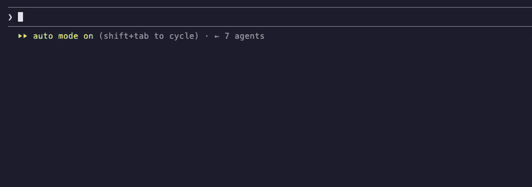

# cc-dino

The T-rex from the browser's offline page, above the Claude Code prompt: jump cacti and duck birds
while Claude works. The run pauses when Claude finishes a turn.



[Watch it as a video](docs/demo.mp4)

Needs function hooks (early access) and an interactive terminal.

## Install

Turn on function hooks in `~/.claude/settings.json`:

```json
{
  "env": { "CLAUDE_CODE_ENABLE_FUNCTION_HOOKS": "1" }
}
```

Then, in Claude Code:

```
/plugin marketplace add giovaborgogno/cc-dino
/plugin install cc-dino@cc-dino
```

Restart Claude Code and run `/dino`.

## Play

| Command | What it does |
| --- | --- |
| `/dino` | open or close the board |
| `/dino auto` | open the board whenever Claude starts working |
| `/dino top` | show the leaderboard |
| `/dino handle @you` | join the leaderboard under your X handle |
| `/dino demo` | watch a run that plays itself |

On the board: click it first, then space or ↑ jumps, ↓ ducks, `p` pauses, `r` restarts, `t` shows
the leaderboard, `h` edits your handle. Esc returns to the prompt.

## Leaderboard

Press `h` on the board (or run `/dino handle @you`) and type your X/Twitter handle.

## Develop

```
bun test
```

## License

MIT
