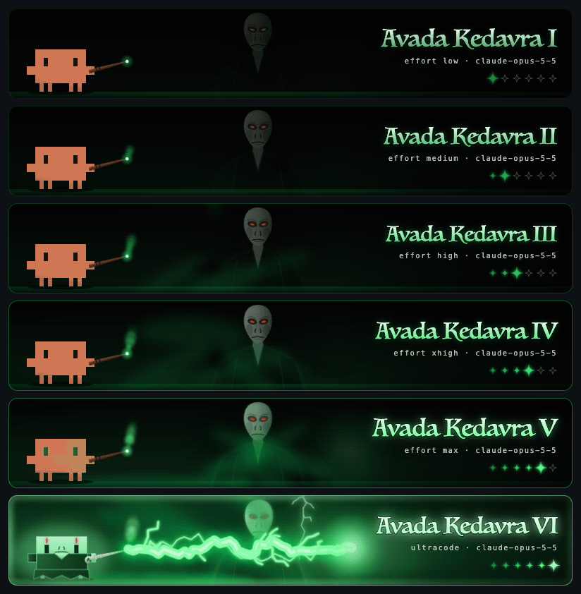
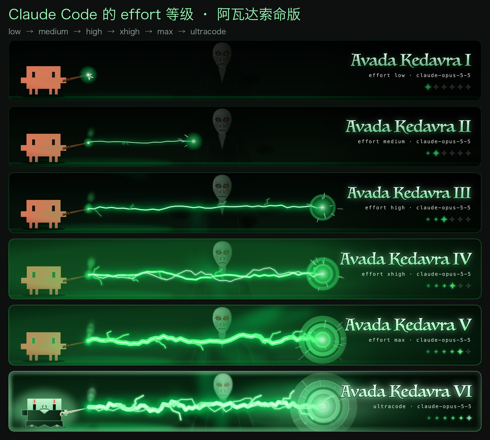
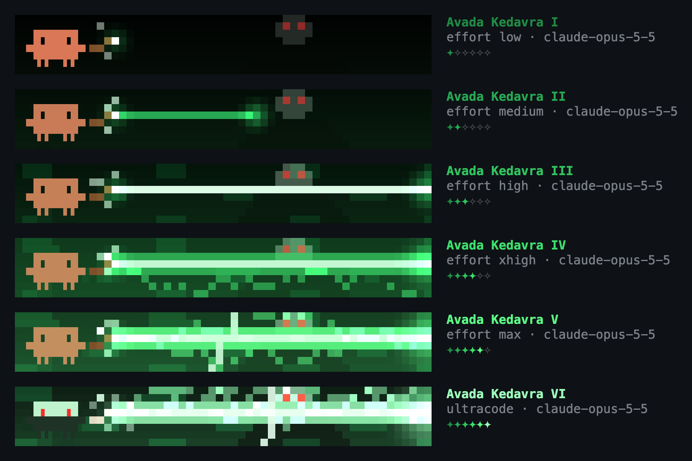

# Spell Bar ⚡ — an Avada Kedavra effort bar for Claude Code

**English** · [中文](#中文)

A [Claude Code mod](https://claude.dev/blog/getting-started-with-claude-code-mods/) that puts an animated bar above the prompt. Clawd raises a wand and casts the Killing Curse at the strength of the session's **effort level**. There is one rank for each position of the effort picker, and every rank adds layers on top of the one below it. Voldemort watches from the smoke behind. At the top rank, Clawd becomes the Dark Lord.



| Rank | Effort | What this rank adds |
|---|---|---|
| I | `low` | Green sparks spit from the wand and the curse fizzles. Voldemort is little more than two red eyes. |
| II | `medium` | A thin, crooked bolt that reaches halfway. |
| III | `high` | The bolt reaches its target, with shockwave rings, green smoke and a flash. Voldemort's face lights up in the flashes. |
| IV | `xhigh` | Arcs coil around the bolt, Clawd's eyes turn green, and the screen shakes. |
| V | `max` | A thicker, pulsing bolt, forked lightning from the sky, and stronger flash and shake. |
| VI | `ultracode` | The jet holds for most of the cast, strobing lightning, a burning frame, and **Clawd turned Dark Lord**: pale green skin, a black robe and Voldemort's bone-white wand. |

In every rank the bolt gets thicker, more crooked and more forked, and the flash, shake and hold last longer.



It runs in the terminal too, drawn in the half-block pixels of Clawd's own logo:



## Features

- **Follows the effort picker live.** Switching effort in the Claude desktop app updates the bar within about 1.5 s, without waiting for the next message. See [how it works](#how-the-effort-is-detected).
- **Tells `max` from `ultracode`.** Neither of them shows up in the effort field that plugins can read.
- **Desktop and terminal.** The desktop app gets an animated SVG banner sized to the band. The terminal gets a 12 fps pixel animation drawn with `Raster`.
- **Commands:**
  - `/spell`: list the ranks and the current state.
  - `/spell 1`…`/spell 6`, `/spell IV`, `/spell max`, `/spell ultracode`: pin a rank so you can look at it.
  - `/spell auto`: follow the effort again.
  - `/spell off` and `/spell on`: hide or show the bar.
  - `/spellbook`: open a pane with all six ranks playing side by side.

## Install

You need a Claude Code build with function-hook mods (2.1.286 or newer), in the desktop app's Code tab or in the terminal.

**From the marketplace:**

```
/plugin marketplace add powerofjinbo/claude-code-spell-bar
/plugin install spell-bar@claude-code-spell-bar
/reload-plugins
```

**From a clone, loaded into every session** (edits to the clone take effect in new sessions):

```bash
git clone https://github.com/powerofjinbo/claude-code-spell-bar.git ~/Documents/GitHub/claude-code-spell-bar
```

Then add this to the `env` block of `~/.claude/settings.json`. Paths are separated by `:` on macOS and Linux. The variable is only read from your user settings, never from a project's.

```json
{
  "env": {
    "CLAUDE_CODE_PLUGIN_DIRS": "/Users/you/Documents/GitHub/claude-code-spell-bar/plugins/spell-bar"
  }
}
```

**For one session only:** `claude --plugin-dir ./plugins/spell-bar`

## How the effort is detected

The plugin API has no effort getter and no event for an effort change, so the bar puts the answer together from two sources:

1. **The flag settings, polled every 1.5 s.** The desktop app applies the picker through the `apply_flag_settings` control request, which lands in the session's flag settings, and `$.settings.read({ source: 'flag' })` can read those.
   - `low`, `medium`, `high` and `xhigh` read as themselves.
   - The settings schema only accepts those four, so **`max` reads as no level at all.** It is recognised by a level disappearing right after the picker had set one.
   - **`ultracode` is its own boolean.** The desktop sends it as `{ effortLevel: "xhigh", ultracode: true }`.
2. **Each model request (`turn.step`).** A request carries the effort it was sent with. This fills in what the flags cannot tell, such as `max` or the effort a session was launched with.

There is one limitation. A new session receives its starting effort as a launch flag, not through the flag settings. If the session's flags already hold `ultracode: false` when it starts and the first pick is `max`, nothing changes that the plugin can see, so the bar catches up at the next message.

## Development

```
plugins/spell-bar/
  .claude-plugin/plugin.json   manifest
  hooks/hooks.json             -> register.tsx
  hooks/register.tsx           hooks: band, pane, commands, effort tracking
  hooks/spells.ts              the six ranks, effort -> rank, picker reading
  hooks/scene.ts               the animated SVG banner (desktop)
  hooks/pixels.ts              the half-block pixel animation (terminal)
  types/index.d.ts             the $.state contract
  tests/                       `claude plugin test` suite
scripts/render-demo.mjs        regenerates docs/demo.gif and docs/terminal.png
```

```bash
claude plugin validate plugins/spell-bar   # what the engine will load and refuse
claude plugin test plugins/spell-bar       # run the tests against the engine
claude --plugin-dir plugins/spell-bar      # try it; saving a file hot-reloads it
node scripts/render-demo.mjs               # redraw the demo images (Chrome, Python + Pillow, macOS fonts)
```

To have an editor type-check the hooks, run `/plugin-types` in a session. It writes the API declarations into `.claude-plugin/types/` (git-ignored), which `tsconfig.json` points at.

## Disclaimer

This is an unofficial fan project. Harry Potter, Voldemort and the spell names belong to J.K. Rowling and Warner Bros.; Clawd belongs to Anthropic. The project is not affiliated with or endorsed by any of them. All artwork was drawn from scratch in SVG and pixel code for this project.

## License

[MIT](LICENSE)

---

## 中文

一个 [Claude Code mod](https://claude.dev/blog/getting-started-with-claude-code-mods/)，在输入框上方放一条动画 bar：Clawd 举起魔杖施放**阿瓦达索命**，威力随当前会话的 **effort 档位**变化。effort 选择器的每个位置对应一档，每档都在下一档的基础上叠加新效果，伏地魔在背景的烟雾里注视着。到最高档 ultracode，Clawd 会变成伏地魔。

| 档 | effort | 新叠加的效果 |
|---|---|---|
| Ⅰ | `low` | 杖尖冒出绿色火星，咒语哑火；伏地魔只看得到一双红眼 |
| Ⅱ | `medium` | 一道细细的锯齿闪电，只射出一半 |
| Ⅲ | `high` | 闪电射满全程，加冲击环、绿色烟雾和全屏闪光，伏地魔的脸在闪光中显形 |
| Ⅳ | `xhigh` | 光束外缠绕电弧，Clawd 眼睛变绿，画面震动 |
| Ⅴ | `max` | 闪电更粗并脉动，天降分叉落雷，闪光和震动更强 |
| Ⅵ | `ultracode` | 光束持续轰击，多道落雷频闪，边框燃起绿光，**Clawd 变身伏地魔**：苍白泛绿的脸、黑袍、骨白魔杖 |

**功能：**

- **实时跟随 effort**：在桌面版切换 effort，约 1.5 秒内 bar 就会跟着变，不用等发消息。
- **区分 max 和 ultracode**：插件读到的 effort 字段里这两档都没有，靠另外的信号区分。
- **桌面版和终端都支持**：桌面版是 SVG 动画，终端版是 12 fps 的像素动画。
- **命令**：
  - `/spell`：列出各档和当前状态；
  - `/spell 1`～`6` 或 `/spell max`：固定显示某一档；
  - `/spell auto`：恢复跟随 effort；
  - `/spell off` / `/spell on`：隐藏或显示 bar；
  - `/spellbook`：打开面板，6 档同时播放。

**安装：**

- 用上面英文部分的 marketplace 命令；
- 或者 clone 仓库，在 `~/.claude/settings.json` 的 `env` 里设置 `CLAUDE_CODE_PLUGIN_DIRS`，指向 `plugins/spell-bar`。之后每个新会话都会自动加载。

**原理和局限**：

- 桌面版切换 effort 时，会把档位写进会话的 flag 设置，插件每 1.5 秒读一次。
- low 到 xhigh 能直接读到。`max` 会被设置格式丢掉，只能通过"刚才的档位消失了"推断出来。`ultracode` 是一个单独的布尔开关，可以直接读。
- 唯一的死角：新会话启动时 flag 里如果已经带着 `ultracode: false`，第一次切换又正好选 max，插件看不到变化，要等下一条消息才更新。

**免责声明**：本项目是非官方的同人作品。哈利波特、伏地魔和咒语名称归 J.K. Rowling 与华纳兄弟所有，Clawd 归 Anthropic 所有，本项目与上述各方均无关联。所有图像都是用 SVG 和像素代码从零绘制的。采用 MIT 许可证。
